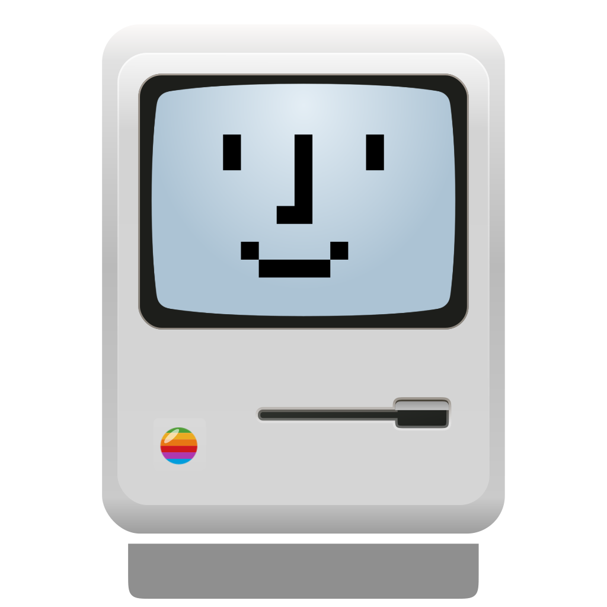

[English](./README.md) | [中文](./README.zh-CN.md)

#  Kyo.is

**你的书签即桌面。**

Kyo.is 是一个个人网页入口，链接即操作系统。在 CLI 和 AI 将一切入口压缩的时代——Notion 是一个链接，Figma 是一个链接，ChatGPT 也是一个链接——你不再需要下载任何东西，你只需要一个地方来放置它们。

**[在线体验 → kyo.is](https://kyo.is)**

---

## 产品哲学

### 失焦即入口

打开浏览器的那一刻，应该像回家，而不是打卡。Kyo.is 拥抱模糊、静止与留白。它不是效率仪表盘，而是你居住的房间。

### 链接是万能容器

链接可以承载一切——工具、文档、视频、AI 助手。当一切都变成链接，浏览器就是操作系统，首页就是桌面。

### 信息是整理和使用出来的

信息不是通过压缩和检索进入你的大脑的。它通过整理、使用和欲望生长出来。你保存一个链接的欲望，本身就是这个链接的意义。

---

## Kyo.is 不是什么

| | Kyo.is | Cubox |
|--|--------|-------|
| **隐喻** | 房间 | 仓库 |
| **核心动作** | 与之共处 | 捕获与检索 |
| **心理** | 需要时它就在 | 存了但没看 |

| | Kyo.is | iTab |
|--|--------|------|
| **内容** | 只有你选择的 | 外部信息流 |
| **信息流向** | 你 → 桌面 | 世界 → 你 |
| **变化时机** | 只有你改变它 | 每天（热搜更新） |

> Cubox 问：你存的东西在哪？  
> iTab 问：今天什么热门？  
> **Kyo.is 问：你想把什么放在桌面上？**

---

## 三层架构

```
┌─────────────────────────────────────────────┐
│  第一层：表层 — 你看到的                      │
│  壁纸 + Dock + 快速访问                      │
│  ← 这是你的「桌面」                          │
├─────────────────────────────────────────────┤
│  第二层：入口层 — 你触发的                    │
│  ⌘K — 你唯一需要的入口                       │
│  ← 这是你的「命令中心」                       │
├─────────────────────────────────────────────┤
│  第三层：深度层 — 你沉浸的                    │
│  聊天 / 笔记 / 自定义组件                     │
│  ← 这是你的「私人空间」                       │
└─────────────────────────────────────────────┘
```

---

## 功能

### 表层
- 🖼️ **壁纸** — 静态与视频壁纸，支持模糊效果
- 🎯 **Dock** — macOS 风格的常用链接栏
- ✨ **毛玻璃** — 磨砂透明界面

### 入口层
- ⌨️ **⌘K** — 你唯一需要的入口
- 🔖 **书签** — 你的链接，你做主
- 🖱️ **拖拽** — 自由布置你的数字空间

### 深度层 *（即将推出）*
- 💬 **个人 AI** — 理解你的链接收藏，而非通用聊天
- 📝 **快捷便签** — 桌面上的 Markdown 笔记

---

## 路线图

```
第一阶段：做实基座（当前）
├── 清理遗留代码
├── PWA 优化
├── 书签系统增强：拖拽、编辑、导入
└── ⌘K 升级

第二阶段：个人入口
├── Quick Links 模式：桌面直接显示书签网格
├── 链接预览
├── Dock 增强
└── 移动端专属布局

第三阶段：私人空间
├── 个人 AI：搜书签、总结链接、整理分类
├── 快捷便签
└── 第三方组件框架
```

---

## 技术栈

- **框架：** React 19, TypeScript, Vite
- **样式：** Tailwind CSS, shadcn/ui, Framer Motion
- **状态：** Zustand
- **存储：** IndexedDB, LocalStorage
- **AI：** Vercel AI SDK
- **音频：** Tone.js
- **部署：** Vercel

---

## 开发

```bash
bun install
bun run dev
bun run build
```

---

## 为什么叫 Kyo？

鏡 (kyō) — 镜子。

你的数字空间应该映照你，而不是世界的噪音。

---

## 许可

AGPL-3.0 — 详见 [LICENSE](./LICENSE)

本项目源自 [ryokun6/ryos](https://github.com/ryokun6/ryos) — A Web-Based Agentic AI OS

---

*信息不是压缩进你脑子的。*  
*它是整理、使用、和欲望驱动出来的。*
