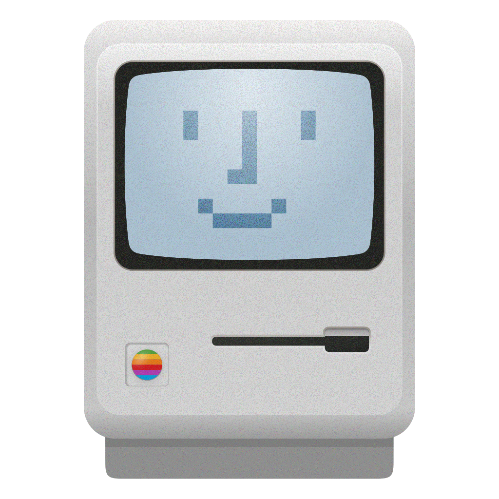

[English](./README.md) | [中文](./README.zh-CN.md)

#  Kyo.is

**你的书签即桌面。**

Kyo.is 是一个个人网页入口，链接即操作系统。在 CLI 和 AI 将一切入口压缩的时代——Notion 是一个链接，Figma 是一个链接，ChatGPT 也是一个链接——你不再需要下载任何东西，你只需要一个地方来放置它们。

**[在线体验 → kyo.is](https://kyo.is)**

---

## 产品哲学

### 失焦即入口

打开浏览器的那一刻，应该像回家，而不是打卡。Kyo.is 拥抱模糊、静止与留白。它不是效率仪表盘，而是你居住的房间。

### 链接是万能容器

链接可以承载一切——工具、文档、视频、AI 助手。当一切都变成链接，浏览器就是操作系统，首页就是桌面。

### 信息是整理和使用出来的

信息不是通过压缩和检索进入你的大脑的。它通过整理、使用和欲望生长出来。你保存一个链接的欲望，本身就是这个链接的意义。

---

## Kyo.is 不是什么

| | Kyo.is | Cubox |
|--|--------|-------|
| **隐喻** | 房间 | 仓库 |
| **核心动作** | 与之共处 | 捕获与检索 |
| **心理** | 需要时它就在 | 存了但没看 |

| | Kyo.is | iTab |
|--|--------|------|
| **内容** | 只有你选择的 | 外部信息流 |
| **信息流向** | 你 → 桌面 | 世界 → 你 |
| **变化时机** | 只有你改变它 | 每天（热搜更新） |

> Cubox 问：你存的东西在哪？  
> iTab 问：今天什么热门？  
> **Kyo.is 问：你想把什么放在桌面上？**

---

## 功能

### 核心应用
- 🔖 **书签** — Pinterest 风格看板，支持文件夹、拖拽排序、云同步
- 💬 **AI 聊天** — 基于 Dify，理解你的链接收藏
- 📝 **便签** — 桌面浮动便签
- 📜 **历史记录** — 所有书签和便签的时间线
- 🎵 **白噪音** — 环境音效与频谱可视化
- ⚙️ **控制面板** — 外观、声音、系统设置

### 桌面体验
- 🖼️ **壁纸** — 47 个瓷砖 + 45 张照片 + 12 个视频
- 🎨 **主题** — macOS Aqua / Windows XP / Windows 98
- 🔊 **音效** — 43 个系统音效，完整 OS 沉浸感

---

## 即将推出

- 🧠 **AI 记忆** — Kyo 跨对话记住你的偏好和决策。与你一起成长的数字助手。

- 🔍 **语义搜索** — 通过含义而非关键词查找书签。搜索理解意图，而不仅仅是文本匹配。

- 🤖 **聊天驱动桌面** — 通过自然对话管理书签。无需离开聊天即可创建、整理和打开链接。

- 🌐 **网页研究助手** — Kyo 可以搜索网页、分析页面、为你收集信息。你的个人研究伙伴。

---

## 技术栈

React 19 · TypeScript · Vite · Tailwind CSS · Zustand · Supabase · Dify AI · Vercel

---

## 开发

```bash
bun install
bun run dev
bun run build
```

---

## 为什么叫 Kyo？

鏡 (kyō) — 镜子。

你的数字空间应该映照你，而不是世界的噪音。

---

## 许可

AGPL-3.0 — 详见 [LICENSE](./LICENSE)

本项目源自 [ryokun6/ryos](https://github.com/ryokun6/ryos) — A Web-Based Agentic AI OS

---

*信息不是压缩进你脑子的。*  
*它是整理、使用、和欲望驱动出来的。*
