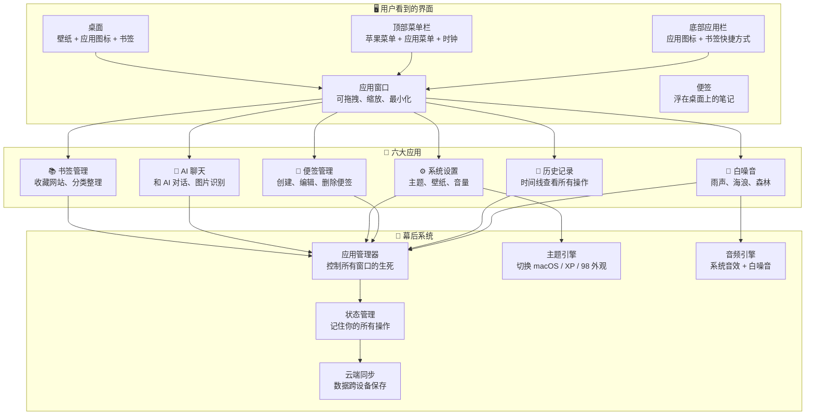
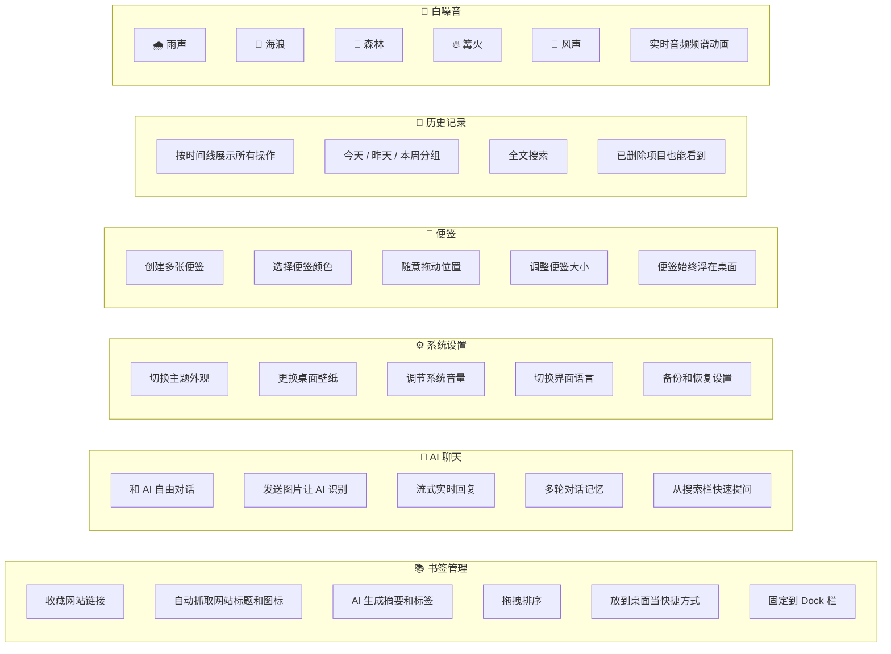
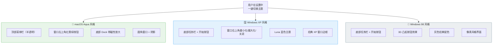
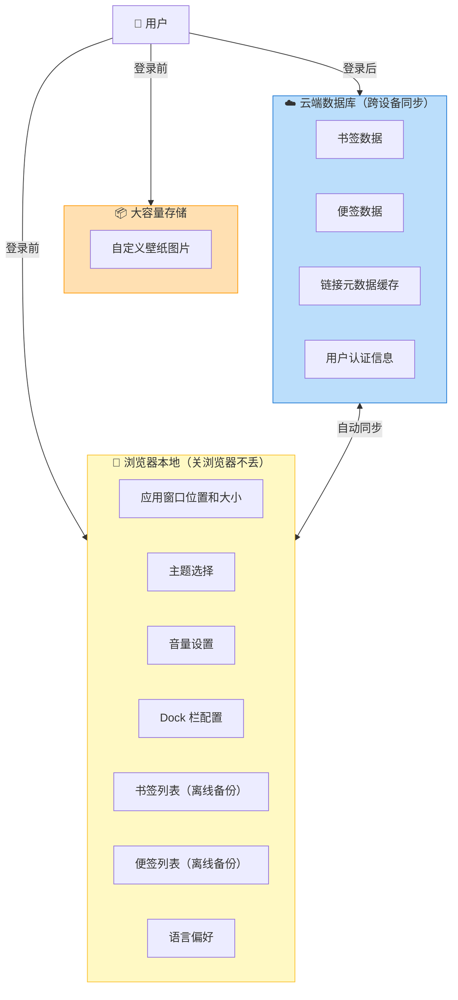
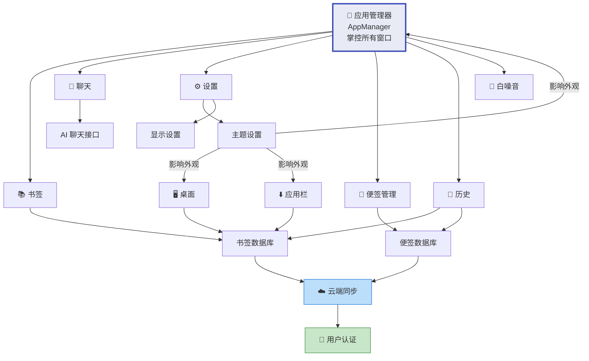
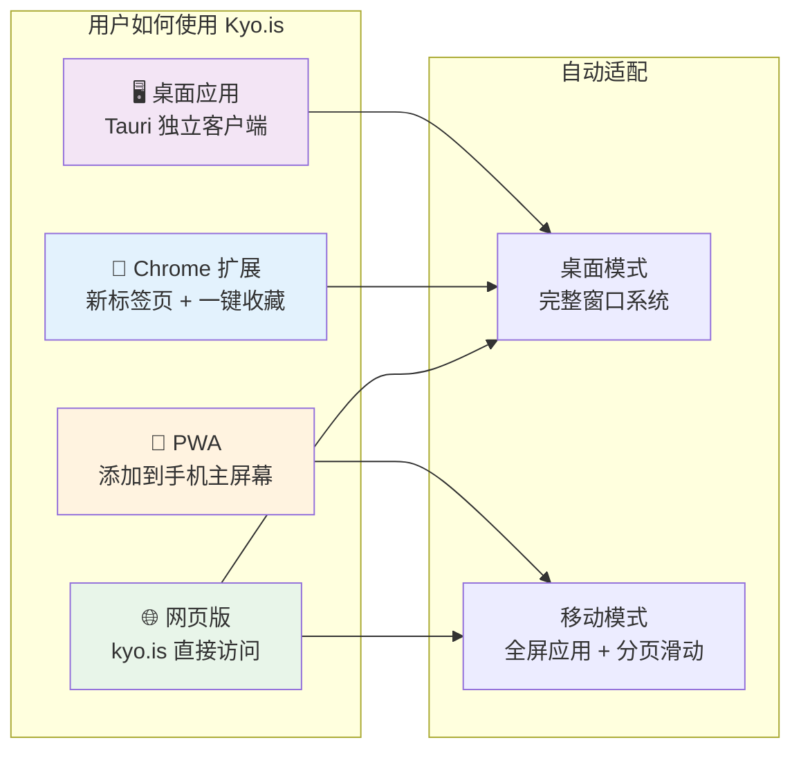
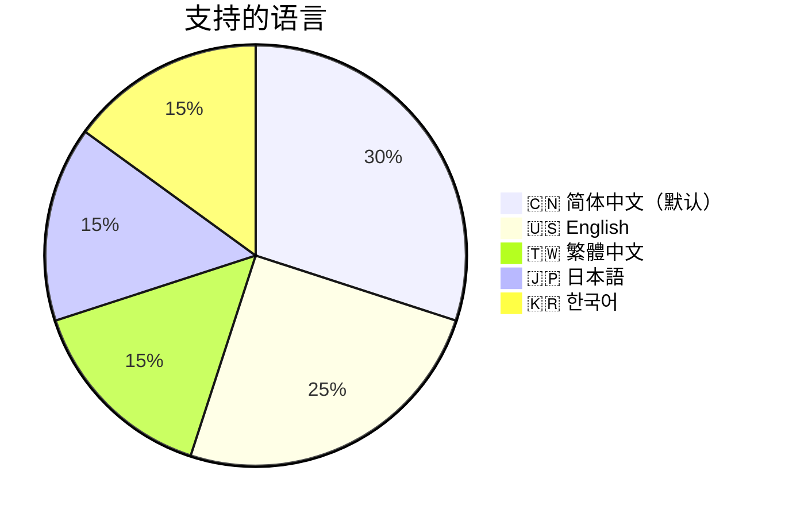
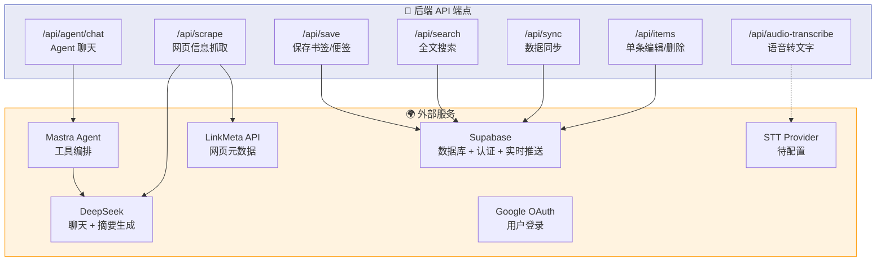
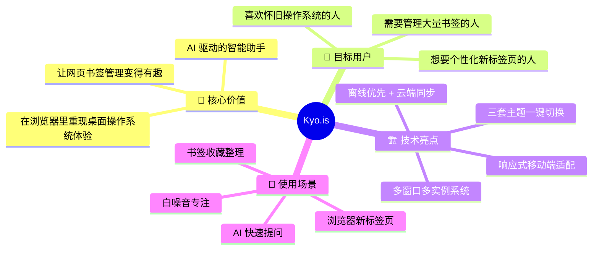

# Kyo.is 系统全局概览

> 写给不懂技术的你：这份文档用图表带你看清整个系统的「骨架」。

---

## 一句话理解 Kyo.is

**Kyo.is 是一个运行在浏览器里的「迷你操作系统」**——它模拟了 macOS / Windows XP / Windows 98 的桌面体验，让用户可以在网页上管理书签、写便签、和 AI 聊天、听白噪音。

---

## 系统全景图

---

## 系统分层架构

把 Kyo.is 想象成一栋五层楼的建筑，每层都有明确的职责：

```mermaid
graph TB
    subgraph L5["第5层 — 用户界面（你看到的一切）"]
        direction LR
        UI1["桌面 Desktop"]
        UI2["菜单栏 MenuBar"]
        UI3["应用栏 Dock"]
        UI4["窗口框架 WindowFrame"]
        UI5["各种弹窗 Dialogs"]
    end

    subgraph L4["第4层 — 六大应用（功能模块）"]
        direction LR
        A1["📚 书签"]
        A2["💬 聊天"]
        A3["⚙️ 设置"]
        A4["📝 便签"]
        A5["📜 历史"]
        A6["🎵 白噪音"]
    end

    subgraph L3["第3层 — 交互逻辑（Hooks 层）"]
        direction LR
        H1["窗口拖拽<br/>useWindowManager"]
        H2["应用启动<br/>useLaunchApp"]
        H3["粘贴处理<br/>usePasteHandler"]
        H4["音效播放<br/>useSound"]
        H5["手势识别<br/>useSwipeNavigation"]
    end

    subgraph L2["第2层 — 状态管理（数据中心）"]
        direction LR
        S1["应用状态<br/>useAppStore"]
        S2["书签数据<br/>useBookmarkStore"]
        S3["便签数据<br/>useStickiesStore"]
        S4["主题设置<br/>useThemeStore"]
        S5["认证信息<br/>useAuthStore"]
    end

    subgraph L1["第1层 — 数据存储（持久化层）"]
        direction LR
        D1["浏览器本地<br/>localStorage"]
        D2["大文件存储<br/>IndexedDB"]
        D3["云端数据库<br/>Supabase"]
        D4["后端 API<br/>Cloudflare Worker"]
    end

    L5 --> L4
    L4 --> L3
    L3 --> L2
    L2 --> L1

    style L5 fill:#E8F5E9,stroke:#4CAF50
    style L4 fill:#E3F2FD,stroke:#2196F3
    style L3 fill:#FFF3E0,stroke:#FF9800
    style L2 fill:#F3E5F5,stroke:#9C27B0
    style L1 fill:#FFEBEE,stroke:#F44336
```

---

## 六大应用功能速览

---

## 三套主题对比

Kyo.is 支持三种完全不同的「操作系统外观」：

---

## 数据在哪里保存？

---

## 核心模块依赖关系

谁依赖谁？一张图看清楚：

---

## 支持的平台和入口

---

## 国际化语言支持

---

## 后端服务一览

---

## 总结：Kyo.is 的产品定位

---

> **下一篇**: [02-app-lifecycle.md](./02-app-lifecycle.md) — 深入了解一个应用从「点击图标」到「关闭窗口」的完整生命周期
