# 应用生命周期：从点击到关闭

> 写给不懂技术的你：一个应用窗口是怎么「出生」、「活着」、「死亡」的？

---

## 总览：应用的一生

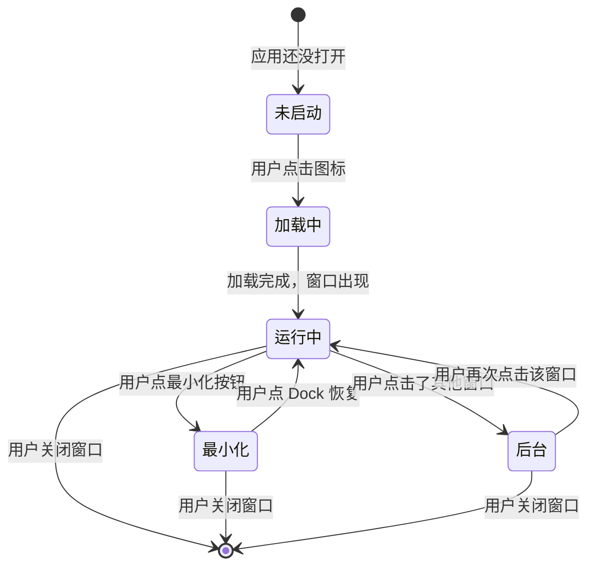

---

## 第一阶段：启动（用户点击图标）

当用户点击某个应用图标时，系统会经历以下步骤：

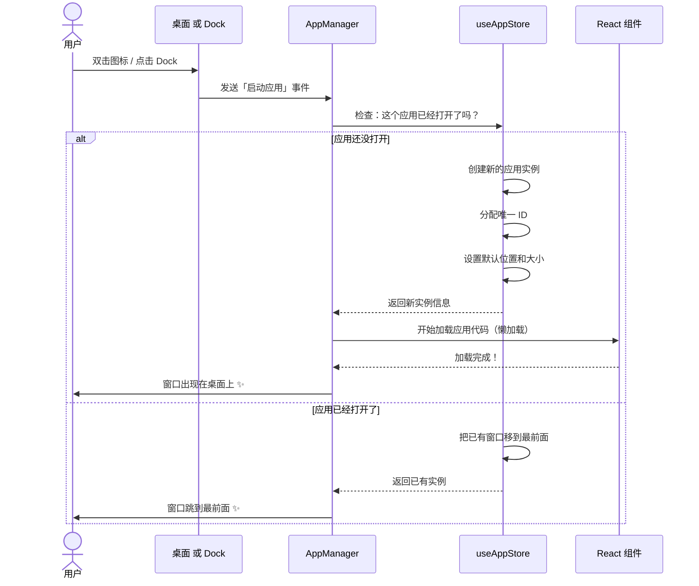

---

## 启动方式大全

用户可以从 **6 个不同入口** 启动应用：

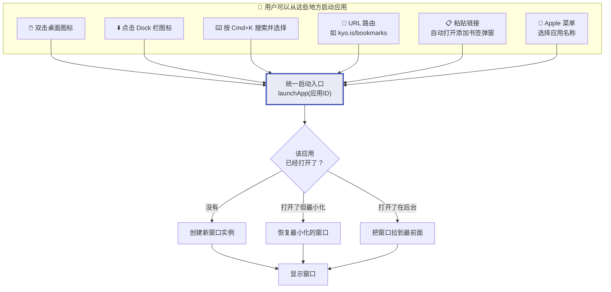

---

## 第二阶段：运行中（窗口的日常）

窗口出现后，用户可以做很多事情：

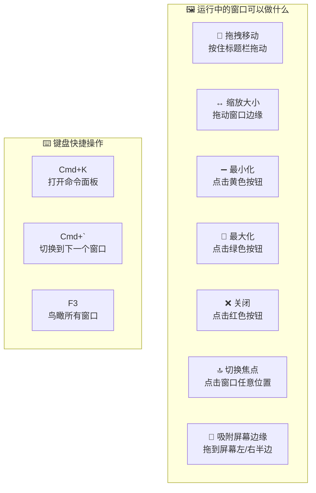

---

## 窗口拖拽的详细流程

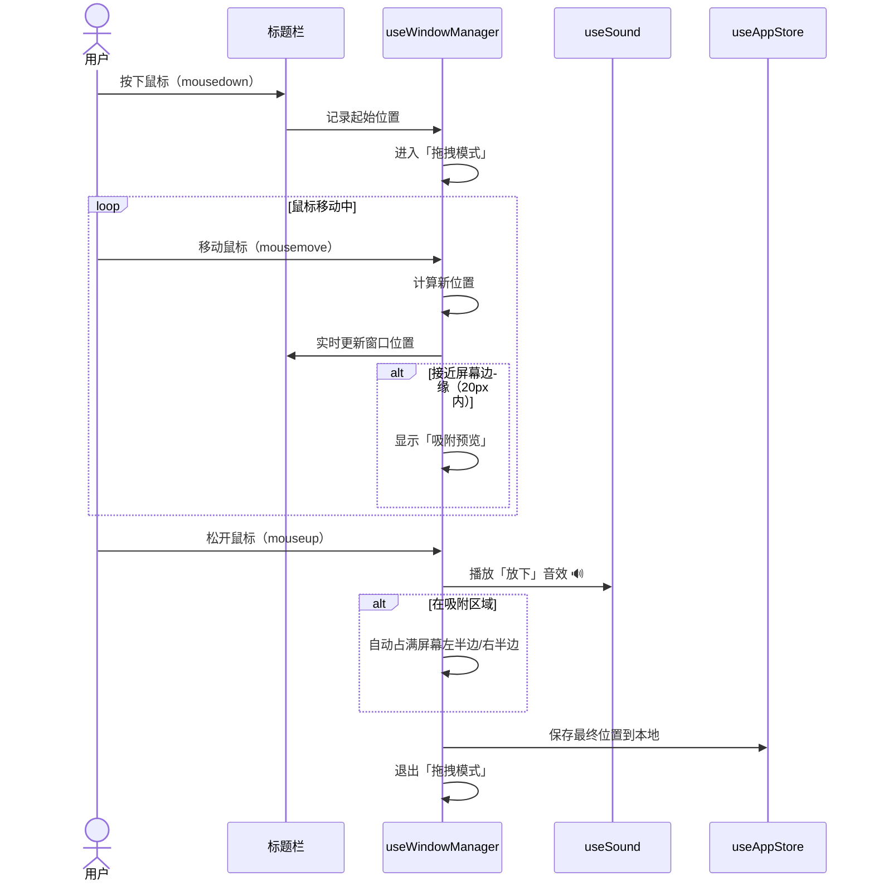

---

## 窗口层级（谁在前面谁在后面）

每个窗口都有一个「层级」，就像叠在一起的纸牌——最上面的窗口是当前焦点窗口。

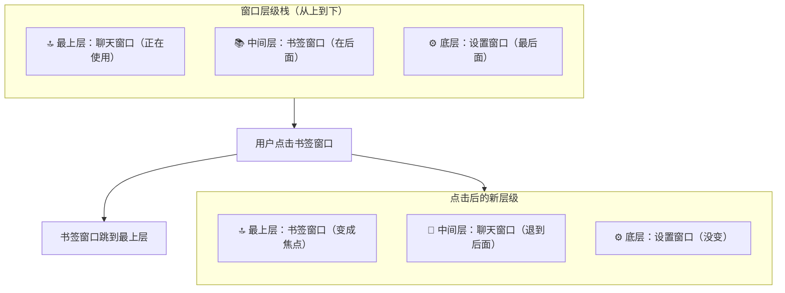

---

## 多实例：同一个应用可以打开多个窗口

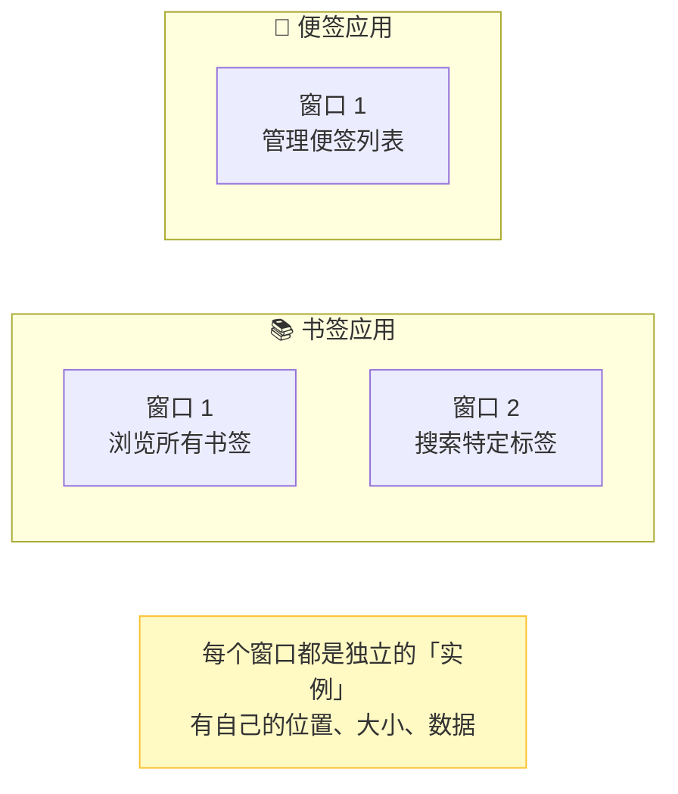

---

## 第三阶段：最小化

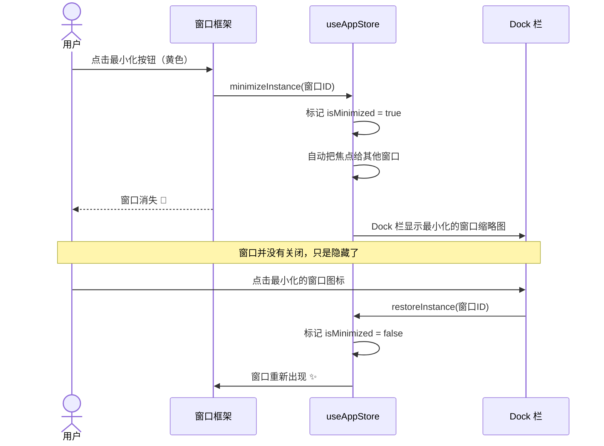

---

## 第四阶段：关闭

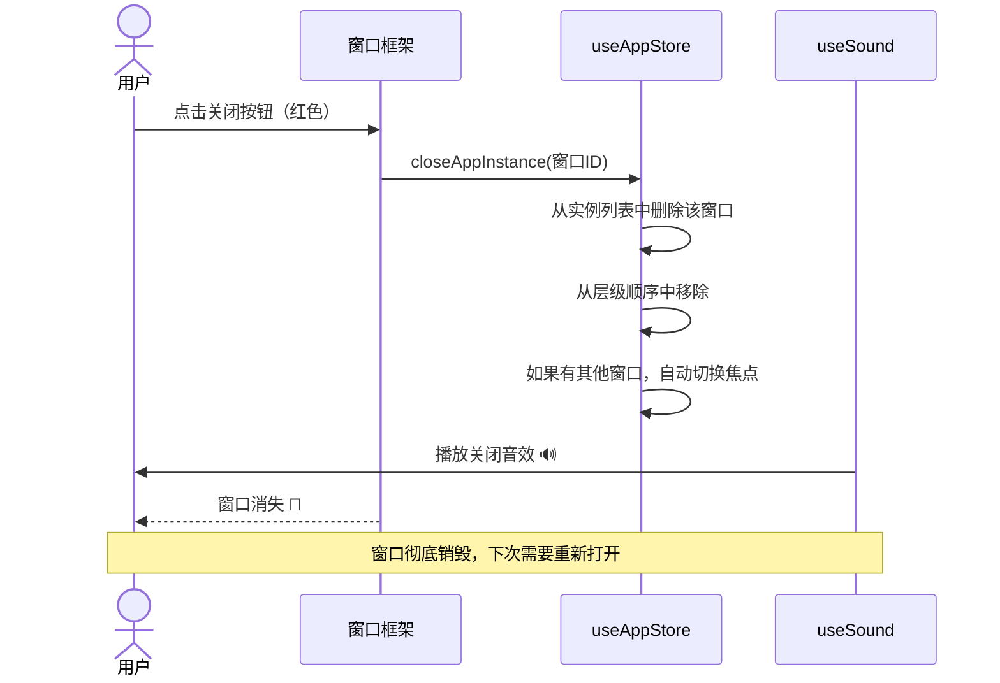

---

## Exposé 鸟瞰模式（F3）

按 F3 键可以一览所有打开的窗口：

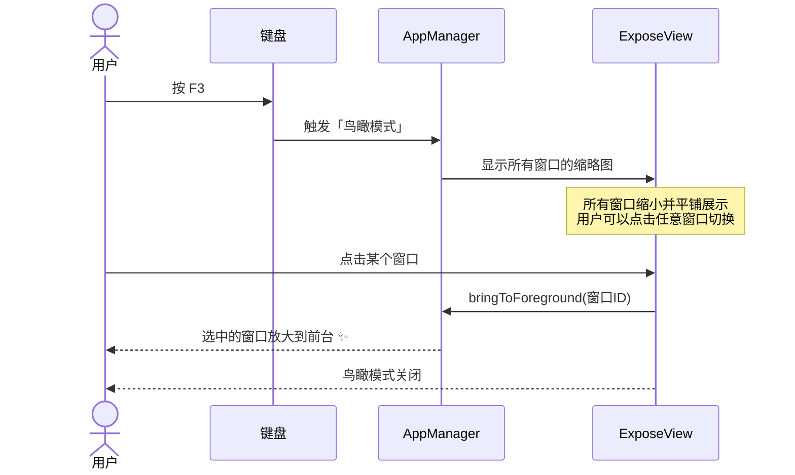

---

## 应用启动时间线

```mermaid
gantt
    title 应用启动完整时间线
    dateFormat X
    axisFormat %L ms

    section 用户操作
    点击图标           :milestone, m1, 0, 0

    section 系统处理
    检查是否已打开      :a1, 0, 10
    创建应用实例        :a2, after a1, 15
    分配窗口位置        :a3, after a2, 5

    section 代码加载
    懒加载应用代码      :b1, after a3, 80
    解析并编译         :b2, after b1, 20

    section 渲染
    首次渲染组件       :c1, after b2, 30
    标记加载完成       :c2, after c1, 5

    section 呈现
    窗口出现动画       :d1, after c2, 200
    用户可交互         :milestone, m2, after d1, 0
```

---

## 便签的特殊生命周期

便签和其他应用不一样——它是桌面的「一等公民」，关闭管理窗口不会让便签消失：

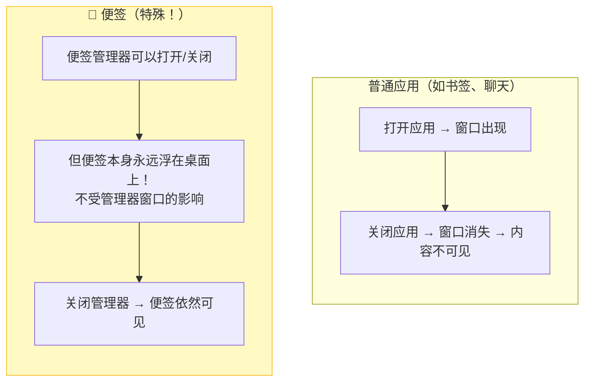

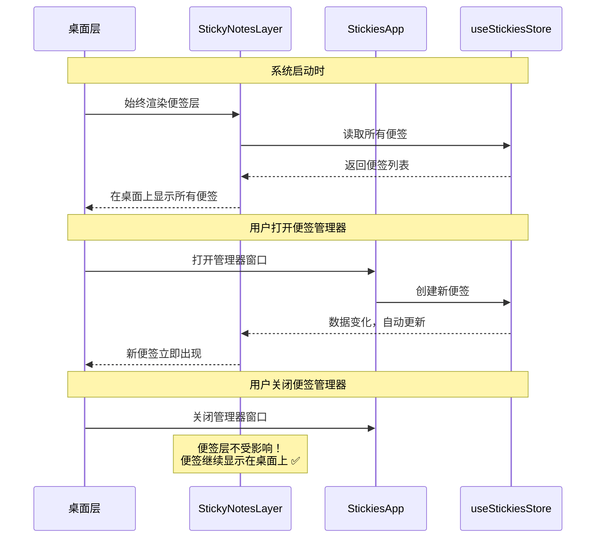

---

## 移动端 vs 桌面端的差异

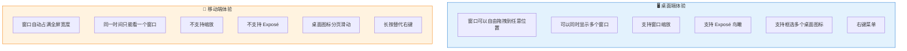

---

## 完整生命周期状态机

把上面所有阶段综合起来：

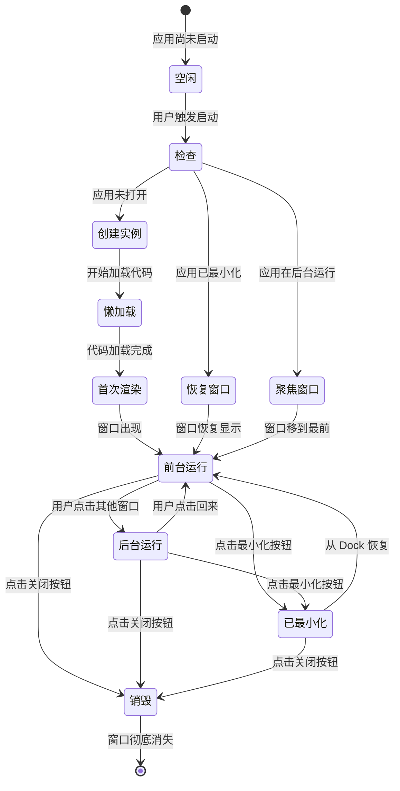

---

> **上一篇**: [01-system-overview.md](./01-system-overview.md) — 系统全局概览
> **下一篇**: [03-data-flow.md](./03-data-flow.md) — 数据如何在系统中流转
