# 数据流转：书签、便签、链接的一生

> 写给不懂技术的你：数据是怎么被创建、保存、同步到云端的？

---

## 数据的三大主角

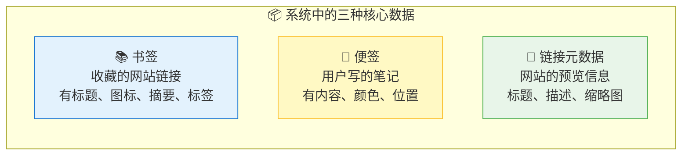

---

## 一、书签的完整生命周期

### 1.1 创建书签的三种方式

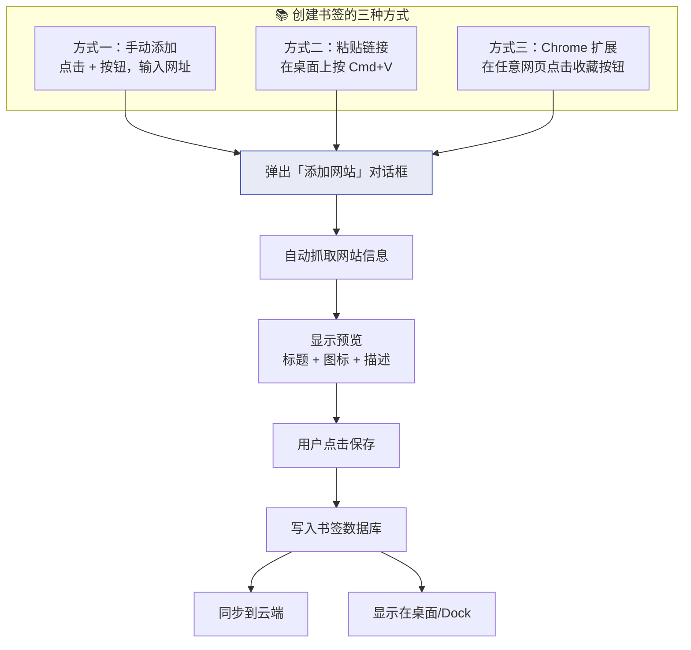

### 1.2 粘贴链接的详细流程

这是最有趣的流程——用户只需要粘贴一个网址，系统就会自动完成所有事情：

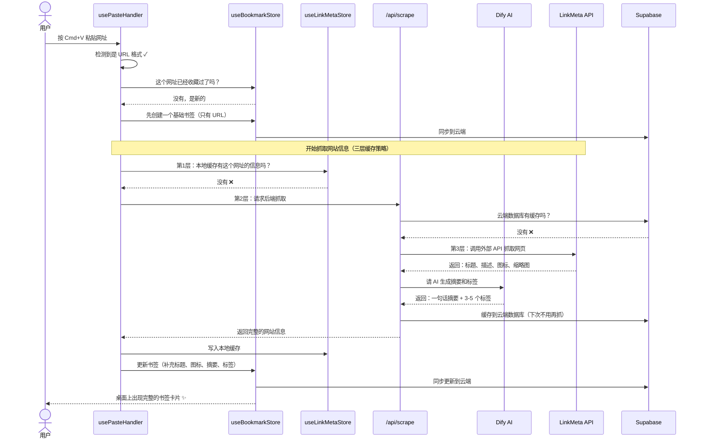

### 1.3 三层缓存策略

为什么要三层缓存？因为抓取网站信息很慢（需要访问外部网站 + AI 生成摘要），缓存可以让重复访问瞬间完成：

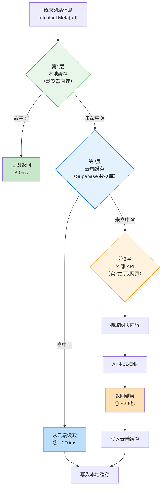

### 1.4 书签数据的存储位置

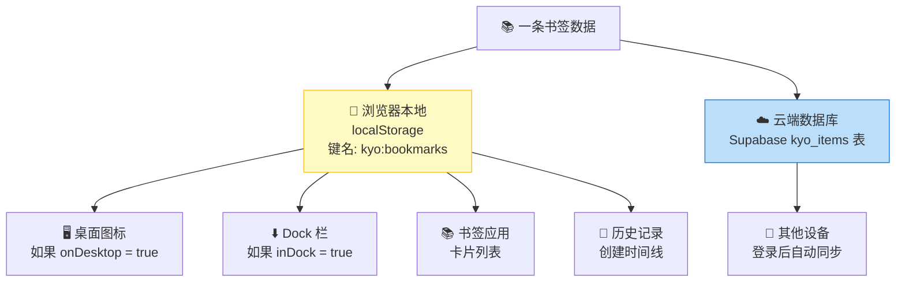

### 1.5 书签的数据结构（简化版）

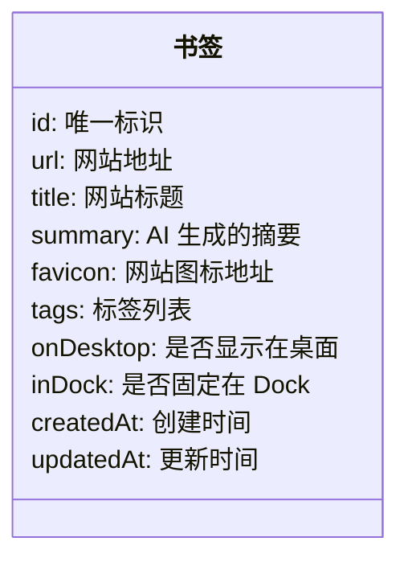

---

## 二、便签的完整生命周期

### 2.1 创建便签

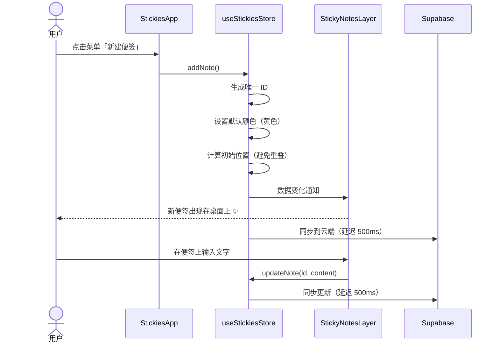

### 2.2 便签的交互操作

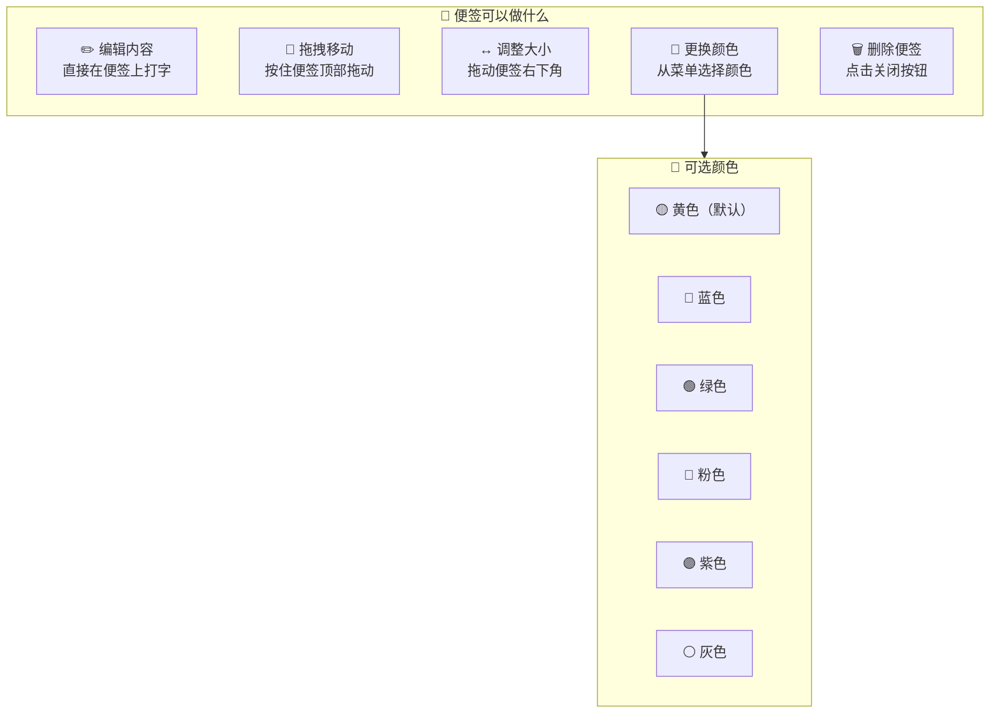

### 2.3 便签 vs 普通应用的数据流差异

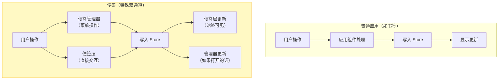

---

## 三、链接元数据的流转

### 3.1 什么是链接元数据？

当你收藏一个网站时，系统需要知道这个网站的「名片」信息：

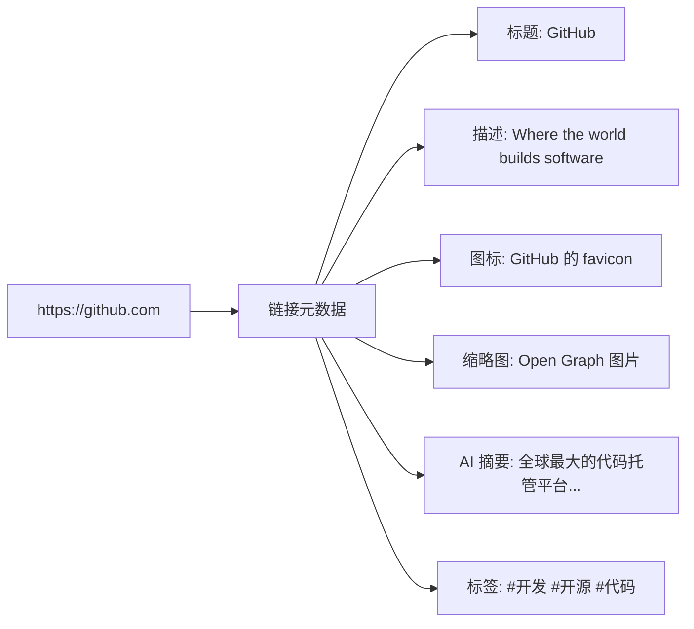

### 3.2 元数据获取的完整流程

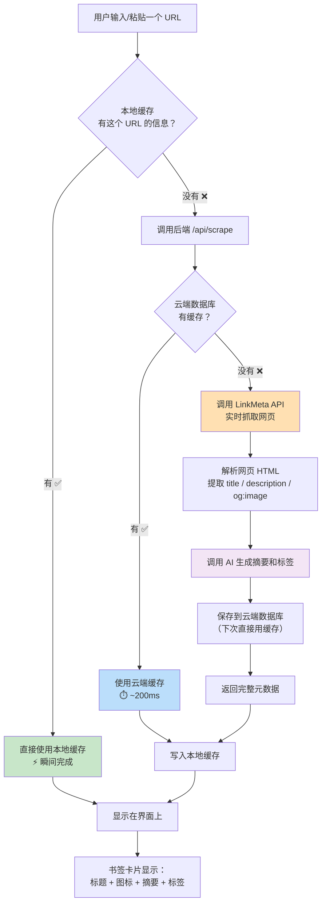

---

## 四、数据同步全景图

### 4.1 本地 → 云端的同步

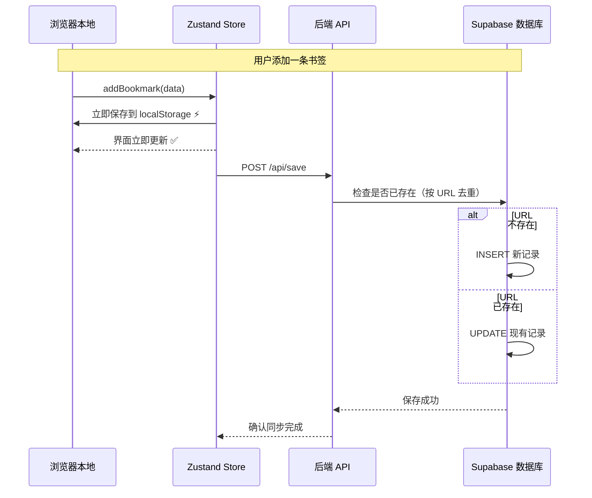

### 4.2 云端 → 本地的同步

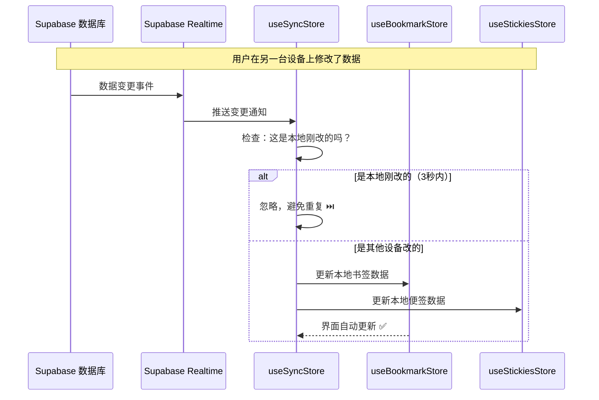

### 4.3 首次登录的数据合并

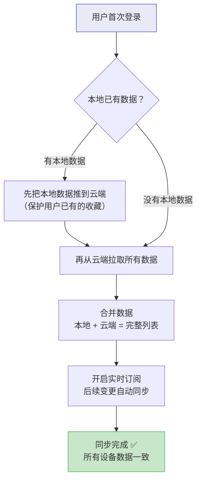

---

## 五、数据的删除流程

### 5.1 删除书签

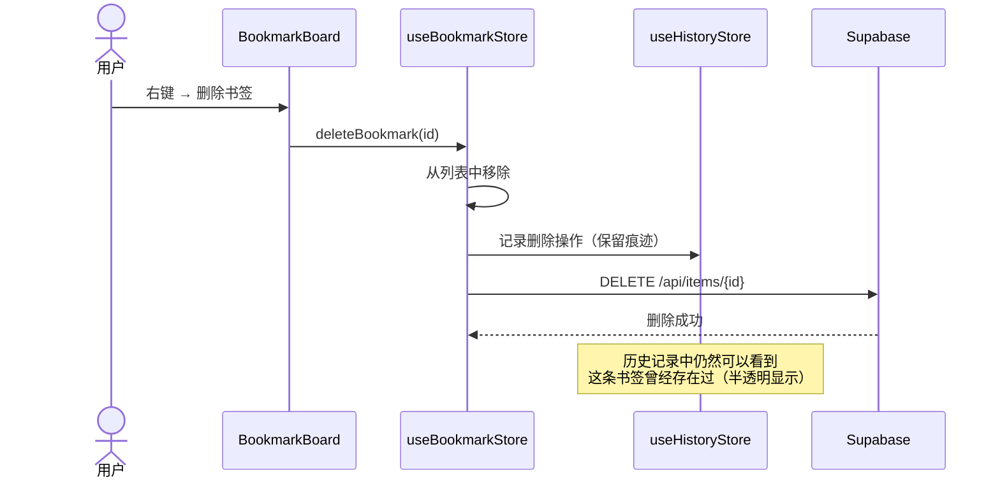

### 5.2 批量删除（桌面框选）

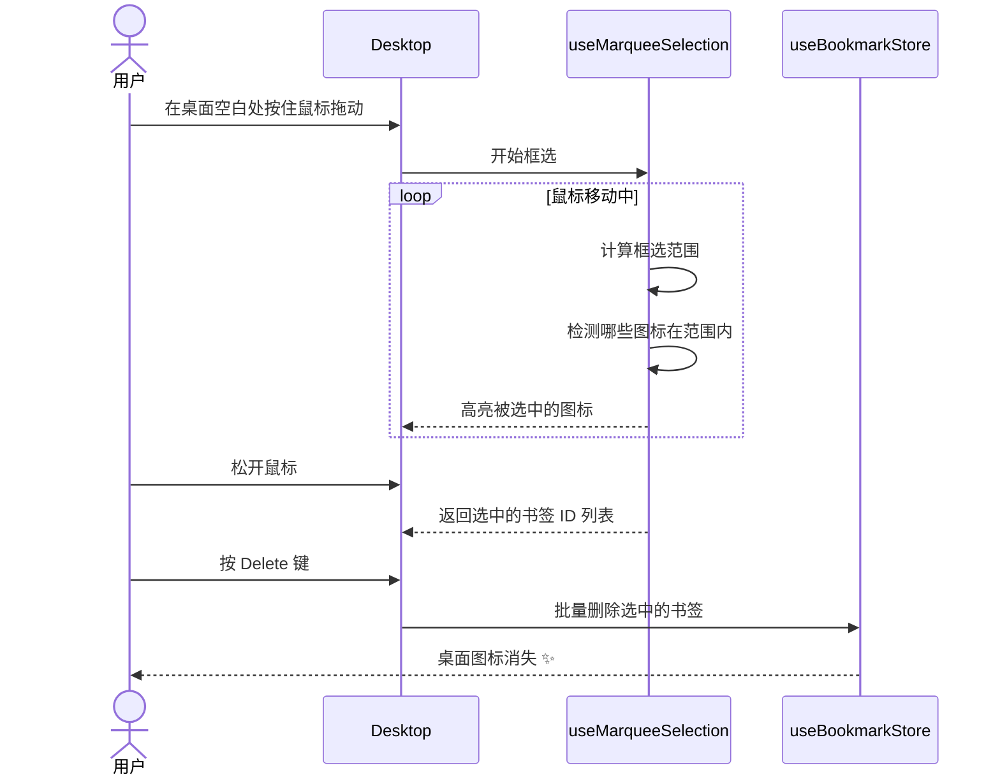

---

## 六、数据流转总览图

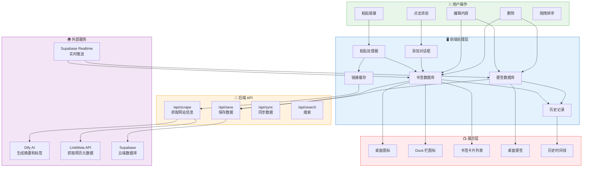

---

## 七、数据一致性保障

系统如何确保数据不会丢失或冲突？

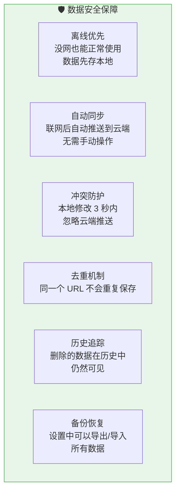

---

> **上一篇**: [02-app-lifecycle.md](./02-app-lifecycle.md) — 应用生命周期
> **下一篇**: [04-theme-system.md](./04-theme-system.md) — 主题系统如何运作
