# 主题系统：三套操作系统外观的切换魔法

> 写给不懂技术的你：Kyo.is 如何做到一键变身 macOS / Windows XP / Windows 98？

---

## 一句话理解

Kyo.is 可以在三种完全不同的「操作系统外观」之间一键切换，就像给房间换了一整套家具和装修风格。

---

## 三套主题长什么样？

```mermaid
graph TB
    subgraph macOS["🍎 macOS Aqua"]
        direction TB
        Mac1["半透明菜单栏"]
        Mac2["红黄绿交通灯按钮（左上角）"]
        Mac3["底部 Dock 带磁性放大效果"]
        Mac4["圆角窗口 + 柔和阴影"]
        Mac5["Aqua 水滴质感"]
    end

    subgraph WinXP["🪟 Windows XP"]
        direction TB
        XP1["底部任务栏 + 开始按钮"]
        XP2["最小化/最大化/关闭（右上角）"]
        XP3["Luna 蓝色渐变标题栏"]
        XP4["方角窗口 + 蓝色边框"]
        XP5["经典 XP 按钮样式"]
    end

    subgraph Win98["💾 Windows 98"]
        direction TB
        W1["底部任务栏 + 开始按钮"]
        W2["3D 凸起/凹陷按钮"]
        W3["灰色经典配色"]
        W4["像素风格边框"]
        W5["复古系统字体"]
    end

    style macOS fill:#E8F5E9,stroke:#4CAF50
    style WinXP fill:#E3F2FD,stroke:#2196F3
    style Win98 fill:#ECEFF1,stroke:#607D8B
```

---

## 主题切换的完整流程

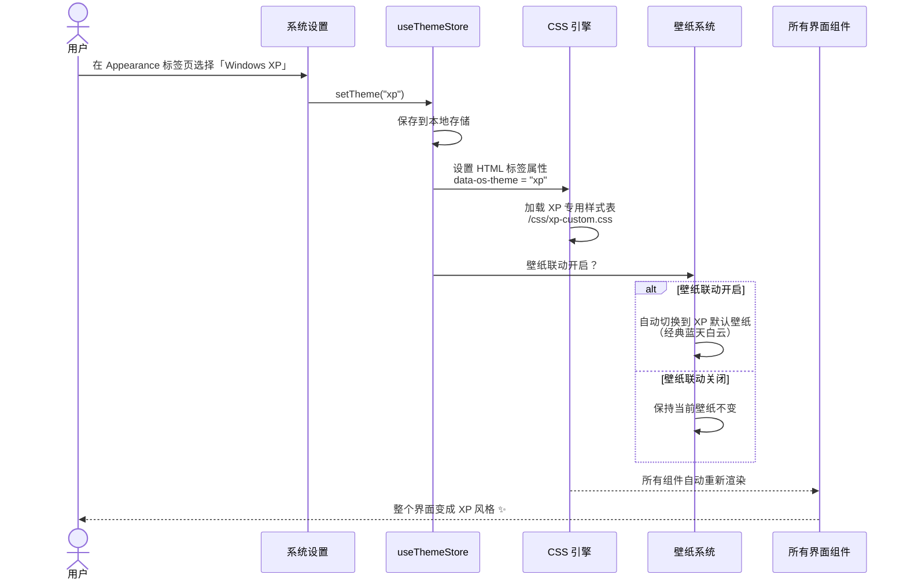

---

## 主题影响了什么？

一次主题切换，会改变界面上的所有这些元素：

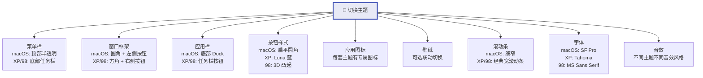

---

## 窗口控制按钮的差异

这是最直观的差异——窗口的「关闭/最小化/最大化」按钮：

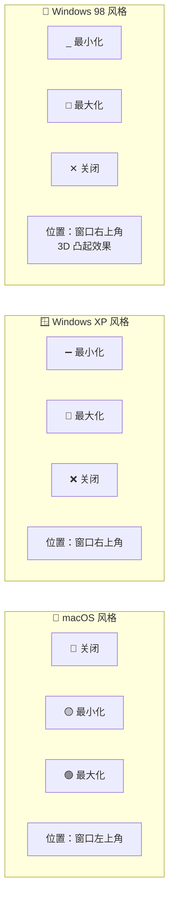

---

## 菜单栏 vs 任务栏

---

## 主题配置的数据结构

每套主题都有一组「配置参数」，决定了界面的每个细节：

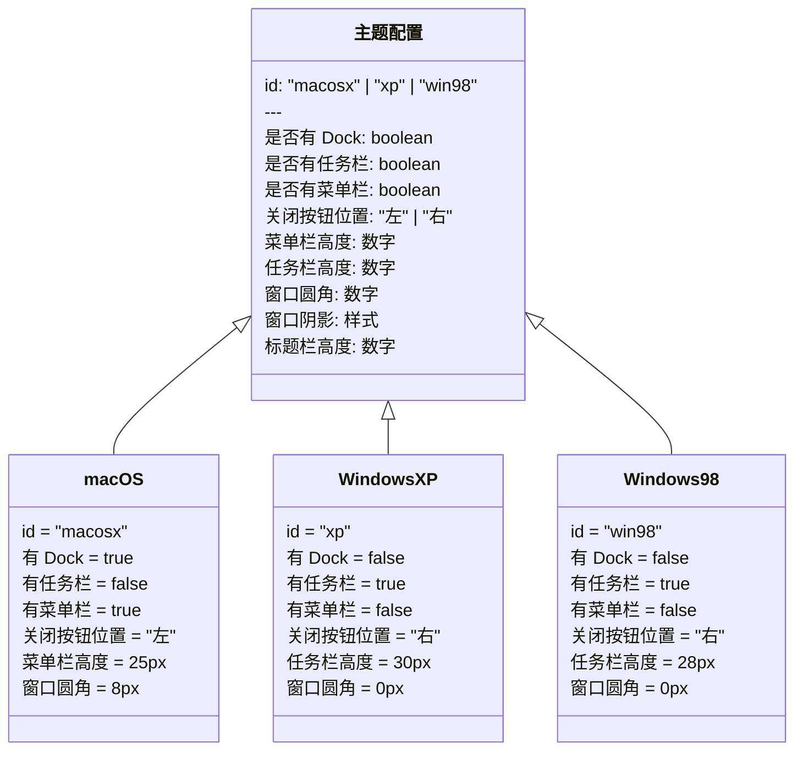

---

## 壁纸联动机制

切换主题时，壁纸可以自动跟着变：

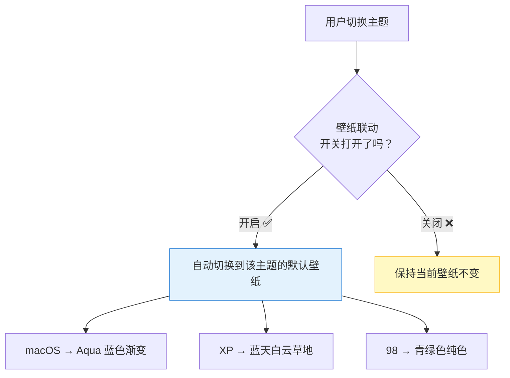

---

## 壁纸系统详解

壁纸不只是一张图片，它有多种类型：

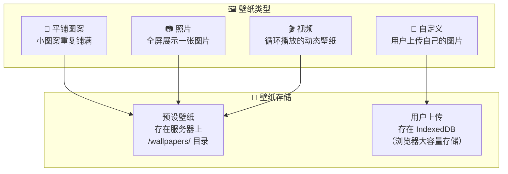

---

## 自定义主题编辑器

除了三套预设主题，用户还可以自定义主题的每个细节：

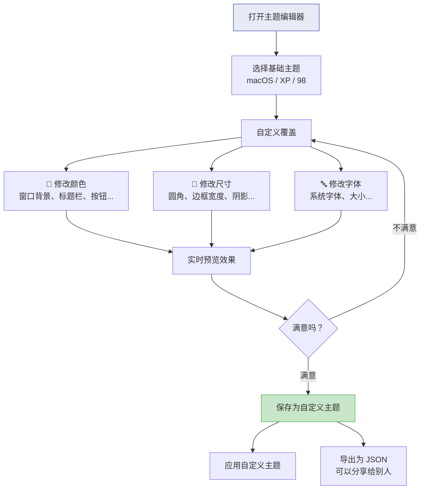

---

## 主题对应用的影响

每个应用都会根据当前主题自动调整外观：

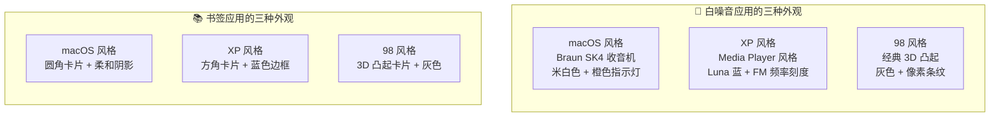

---

## 图标主题系统

每套主题都有自己的图标风格：

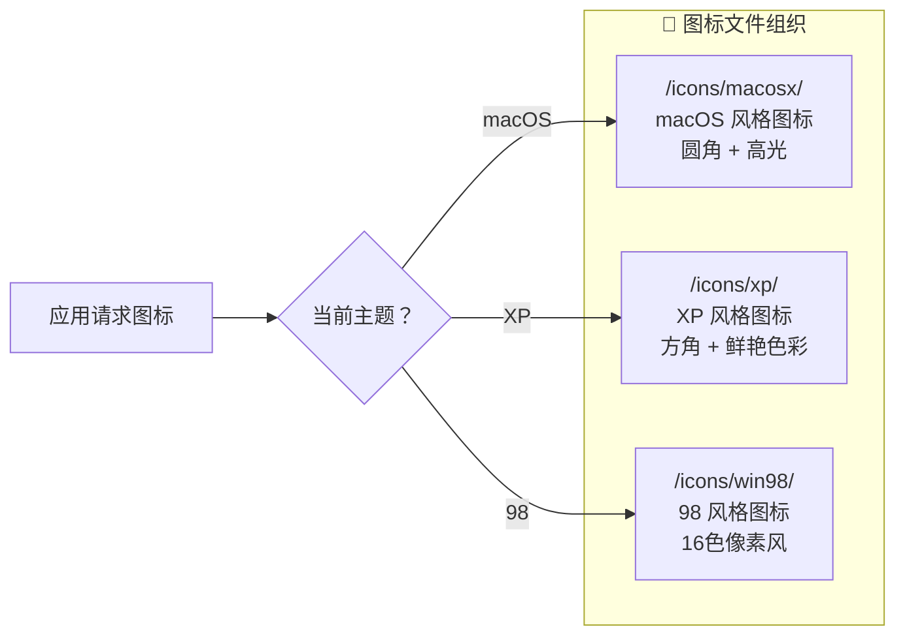

---

## 主题切换的技术原理（简化版）

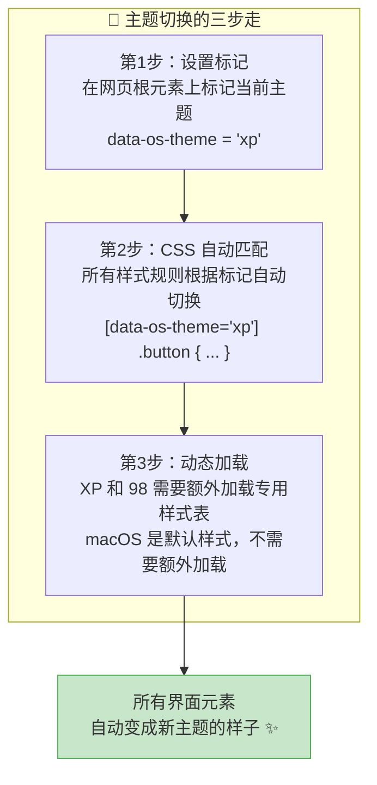

---

## 主题数据的保存和恢复

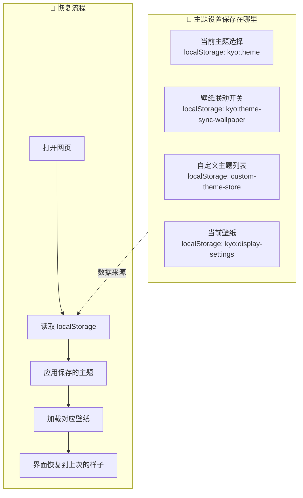

---

## 主题系统总结

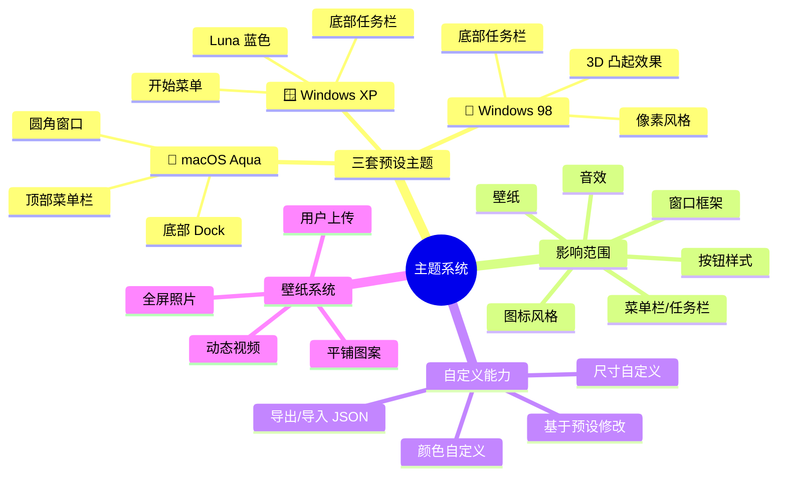

---

> **上一篇**: [03-data-flow.md](./03-data-flow.md) — 数据流转
> **下一篇**: [05-user-journey.md](./05-user-journey.md) — 用户旅程地图
