# 用户旅程地图：核心场景全流程

> 写给不懂技术的你：用户在 Kyo.is 上的每一步操作，背后发生了什么？

---

## 旅程一：首次访问 Kyo.is

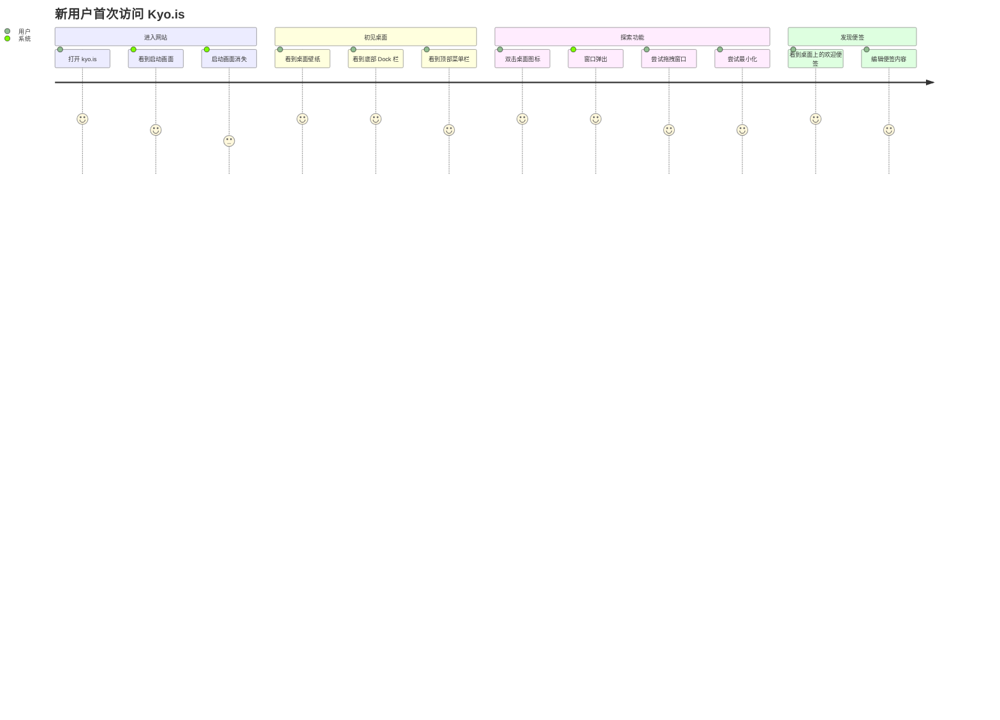
```mermaid
journey
    title 新用户首次访问 Kyo.is
    section 进入网站
      打开 kyo.is: 5: 用户
      看到启动画面: 4: 系统
      启动画面消失: 3: 系统
    section 初见桌面
      看到桌面壁纸: 5: 用户
      看到底部 Dock 栏: 5: 用户
      看到顶部菜单栏: 4: 用户
    section 探索功能
      双击桌面图标: 5: 用户
      窗口弹出: 5: 系统
      尝试拖拽窗口: 4: 用户
      尝试最小化: 4: 用户
    section 发现便签
      看到桌面上的欢迎便签: 5: 用户
      编辑便签内容: 4: 用户
```

### 首次访问的详细流程

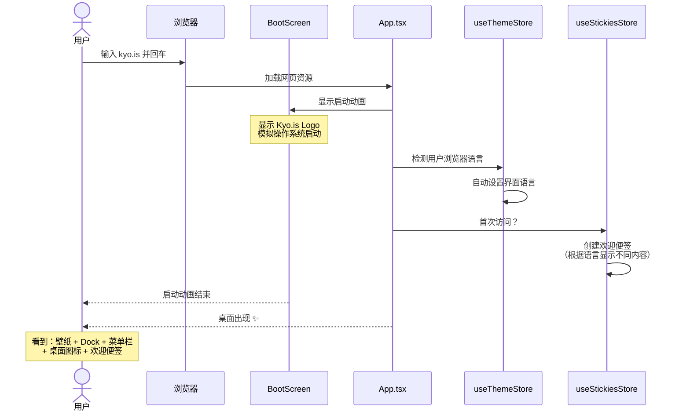
```mermaid
sequenceDiagram
    actor 用户
    participant 浏览器
    participant 启动画面 as BootScreen
    participant 系统 as App.tsx
    participant 主题 as useThemeStore
    participant 便签 as useStickiesStore

    用户->>浏览器: 输入 kyo.is 并回车

    浏览器->>系统: 加载网页资源

    系统->>启动画面: 显示启动动画
    Note over 启动画面: 显示 Kyo.is Logo<br/>模拟操作系统启动

    系统->>主题: 检测用户浏览器语言
    主题->>主题: 自动设置界面语言

    系统->>便签: 首次访问？
    便签->>便签: 创建欢迎便签<br/>（根据语言显示不同内容）

    启动画面-->>用户: 启动动画结束

    系统-->>用户: 桌面出现 ✨
    Note over 用户: 看到：壁纸 + Dock + 菜单栏<br/>+ 桌面图标 + 欢迎便签
```

---

## 旅程二：收藏一个网站

这是 Kyo.is 最核心的功能之一。

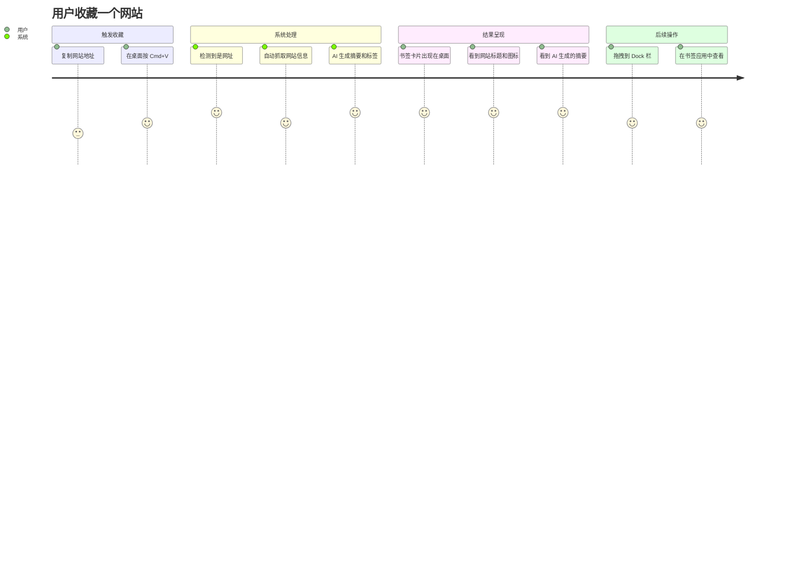
```mermaid
journey
    title 用户收藏一个网站
    section 触发收藏
      复制网站地址: 3: 用户
      在桌面按 Cmd+V: 4: 用户
    section 系统处理
      检测到是网址: 5: 系统
      自动抓取网站信息: 4: 系统
      AI 生成摘要和标签: 5: 系统
    section 结果呈现
      书签卡片出现在桌面: 5: 用户
      看到网站标题和图标: 5: 用户
      看到 AI 生成的摘要: 5: 用户
    section 后续操作
      拖拽到 Dock 栏: 4: 用户
      在书签应用中查看: 4: 用户
```

### 收藏网站的完整流程

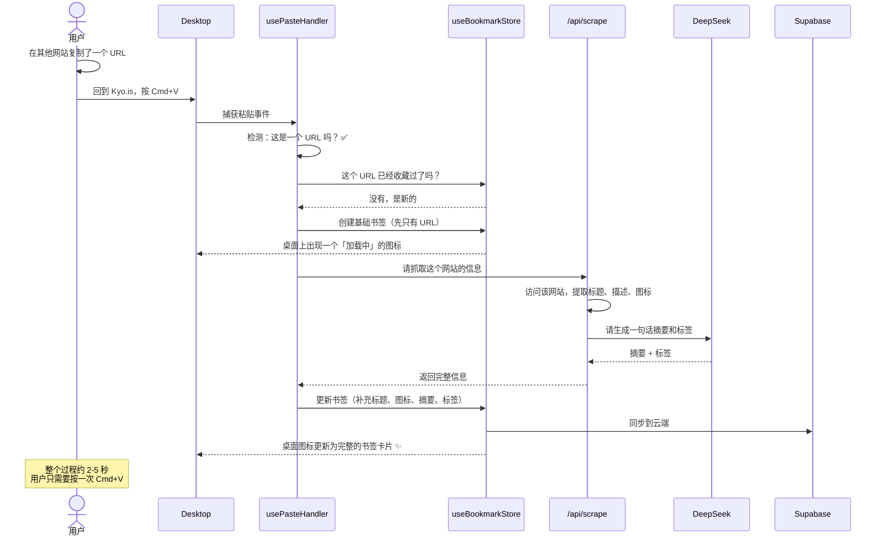
```mermaid
sequenceDiagram
    actor 用户
    participant 桌面 as Desktop
    participant 粘贴 as usePasteHandler
    participant 书签DB as useBookmarkStore
    participant 后端 as /api/scrape
    participant AI as DeepSeek
    participant 云端 as Supabase

    用户->>用户: 在其他网站复制了一个 URL
    用户->>桌面: 回到 Kyo.is，按 Cmd+V

    桌面->>粘贴: 捕获粘贴事件
    粘贴->>粘贴: 检测：这是一个 URL 吗？ ✅

    粘贴->>书签DB: 这个 URL 已经收藏过了吗？
    书签DB-->>粘贴: 没有，是新的

    粘贴->>书签DB: 创建基础书签（先只有 URL）
    书签DB-->>桌面: 桌面上出现一个「加载中」的图标

    粘贴->>后端: 请抓取这个网站的信息
    后端->>后端: 访问该网站，提取标题、描述、图标
    后端->>AI: 请生成一句话摘要和标签
    AI-->>后端: 摘要 + 标签

    后端-->>粘贴: 返回完整信息

    粘贴->>书签DB: 更新书签（补充标题、图标、摘要、标签）
    书签DB->>云端: 同步到云端

    书签DB-->>桌面: 桌面图标更新为完整的书签卡片 ✨

    Note over 用户: 整个过程约 2-5 秒<br/>用户只需要按一次 Cmd+V
```

---

## 旅程三：和 AI 聊天

```mermaid
journey
    title 用户和 AI 对话
    section 打开聊天
      点击 Dock 上的聊天图标: 5: 用户
      聊天窗口打开: 5: 系统
    section 开始对话
      输入问题: 4: 用户
      点击发送: 4: 用户
      AI 开始回复: 5: 系统
      看到文字逐字出现: 5: 用户
    section 高级功能
      粘贴一张图片: 4: 用户
      AI 识别图片内容: 5: 系统
      继续追问: 4: 用户
```

### AI 聊天的详细流程

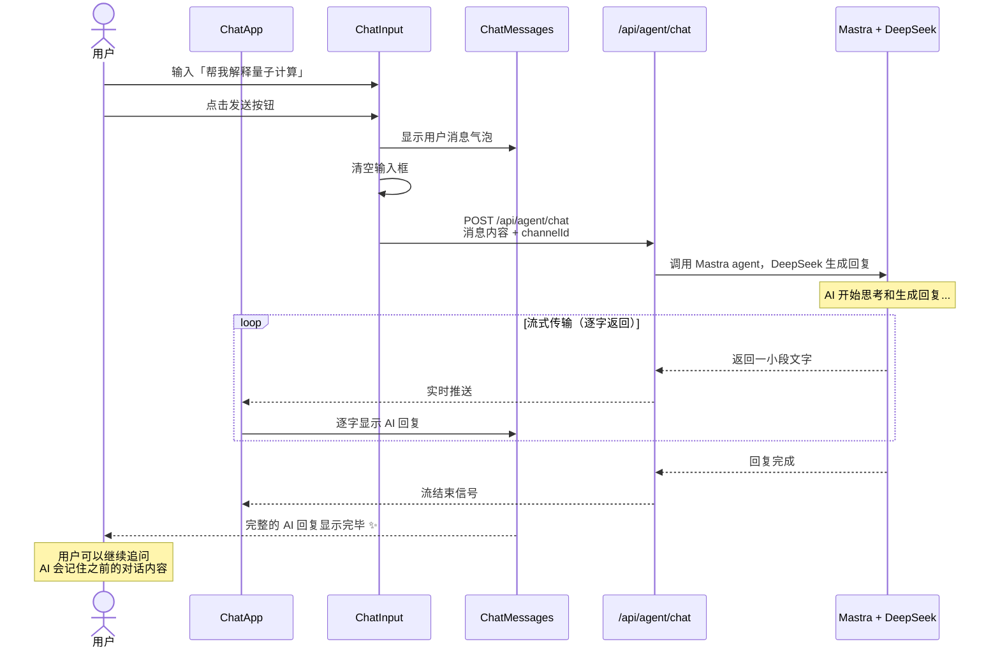
```mermaid
sequenceDiagram
    actor 用户
    participant 聊天窗口 as ChatApp
    participant 输入框 as ChatInput
    participant 消息列表 as ChatMessages
    participant 后端 as /api/agent/chat
    participant AI平台 as Mastra + DeepSeek

    用户->>输入框: 输入「帮我解释量子计算」
    用户->>输入框: 点击发送按钮

    输入框->>消息列表: 显示用户消息气泡
    输入框->>输入框: 清空输入框

    输入框->>后端: POST /api/agent/chat<br/>消息内容 + channelId

    后端->>AI平台: 调用 Mastra agent，DeepSeek 生成回复

    Note over AI平台: AI 开始思考和生成回复...

    loop 流式传输（逐字返回）
        AI平台-->>后端: 返回一小段文字
        后端-->>聊天窗口: 实时推送
        聊天窗口->>消息列表: 逐字显示 AI 回复
    end

    AI平台-->>后端: 回复完成
    后端-->>聊天窗口: 流结束信号

    消息列表-->>用户: 完整的 AI 回复显示完毕 ✨

    Note over 用户: 用户可以继续追问<br/>AI 会记住之前的对话内容
```

### 发送图片给 AI

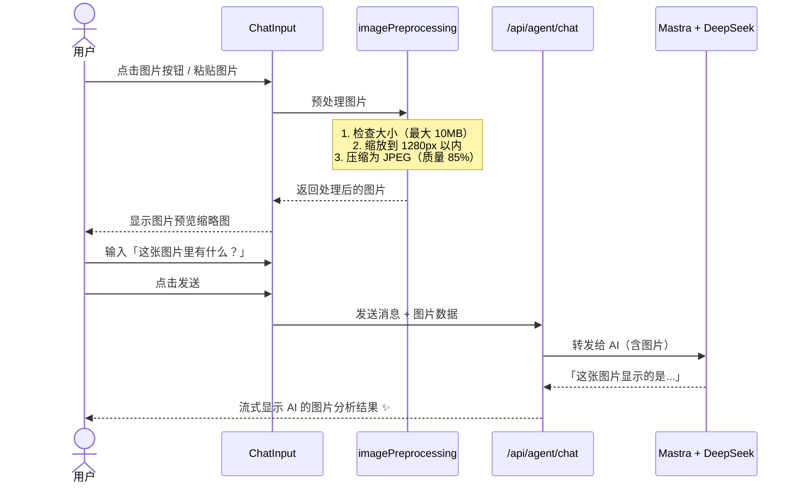
```mermaid
sequenceDiagram
    actor 用户
    participant 输入框 as ChatInput
    participant 图片处理 as imagePreprocessing
    participant 后端 as /api/agent/chat
    participant AI as Mastra + DeepSeek

    用户->>输入框: 点击图片按钮 / 粘贴图片

    输入框->>图片处理: 预处理图片

    Note over 图片处理: 1. 检查大小（最大 10MB）<br/>2. 缩放到 1280px 以内<br/>3. 压缩为 JPEG（质量 85%）

    图片处理-->>输入框: 返回处理后的图片
    输入框-->>用户: 显示图片预览缩略图

    用户->>输入框: 输入「这张图片里有什么？」
    用户->>输入框: 点击发送

    输入框->>后端: 发送消息 + 图片数据
    后端->>AI: 转发给 AI（含图片）

    AI-->>后端: 「这张图片显示的是...」
    后端-->>用户: 流式显示 AI 的图片分析结果 ✨
```

---

## 旅程四：从搜索栏快速操作

按 Cmd+K 可以打开「命令面板」，快速搜索和操作：

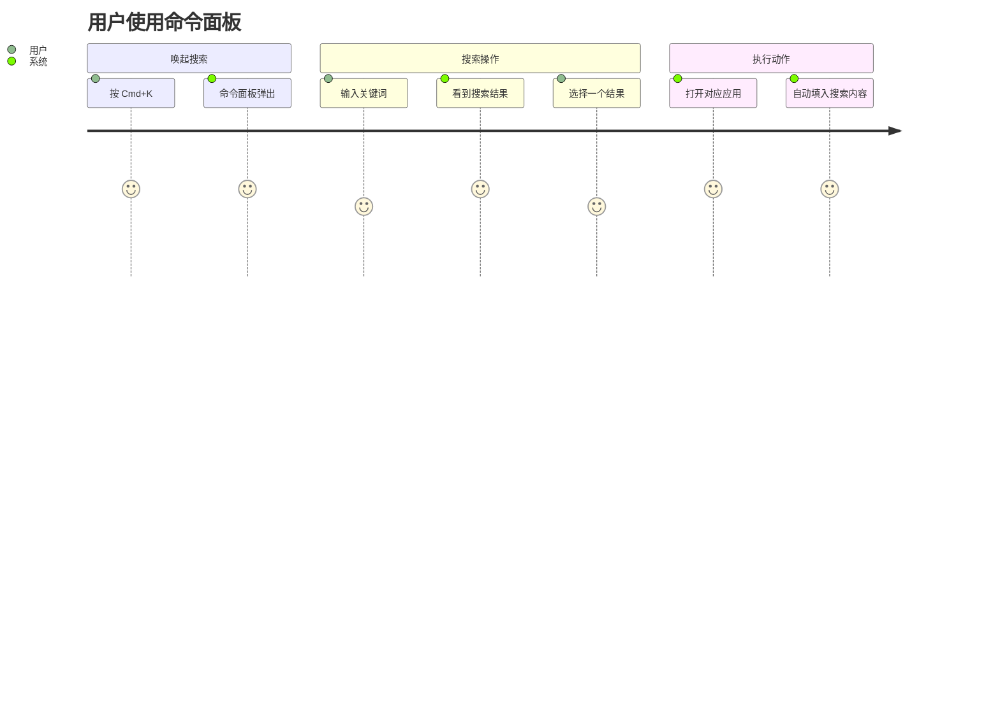
```mermaid
journey
    title 用户使用命令面板
    section 唤起搜索
      按 Cmd+K: 5: 用户
      命令面板弹出: 5: 系统
    section 搜索操作
      输入关键词: 4: 用户
      看到搜索结果: 5: 系统
      选择一个结果: 4: 用户
    section 执行动作
      打开对应应用: 5: 系统
      自动填入搜索内容: 5: 系统
```

### 命令面板的工作流程

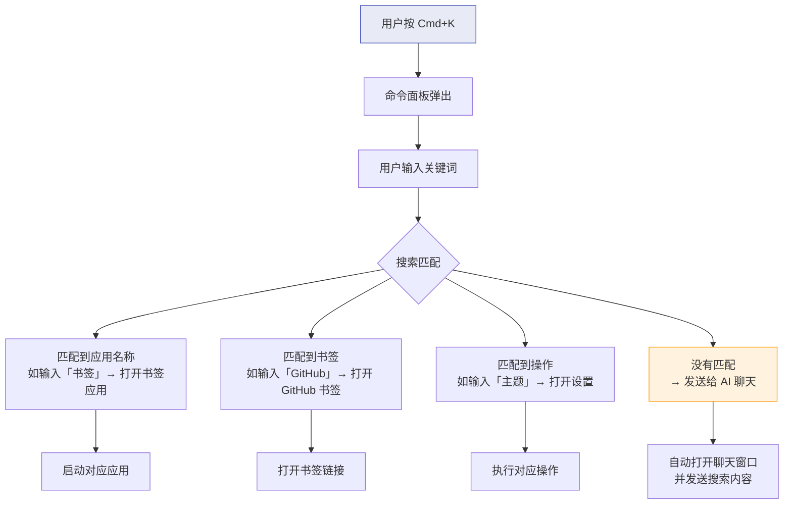
```mermaid
flowchart TB
    CmdK["用户按 Cmd+K"]

    CmdK --> Palette["命令面板弹出"]

    Palette --> Input["用户输入关键词"]

    Input --> Search{"搜索匹配"}

    Search --> Apps["匹配到应用名称<br/>如输入「书签」→ 打开书签应用"]
    Search --> Bookmarks["匹配到书签<br/>如输入「GitHub」→ 打开 GitHub 书签"]
    Search --> Actions["匹配到操作<br/>如输入「主题」→ 打开设置"]
    Search --> AI["没有匹配<br/>→ 发送给 AI 聊天"]

    Apps --> Launch["启动对应应用"]
    Bookmarks --> Open["打开书签链接"]
    Actions --> Execute["执行对应操作"]
    AI --> ChatAuto["自动打开聊天窗口<br/>并发送搜索内容"]

    style CmdK fill:#E8EAF6,stroke:#3F51B5
    style AI fill:#FFF3E0,stroke:#FF9800
```

---

## 旅程五：切换主题

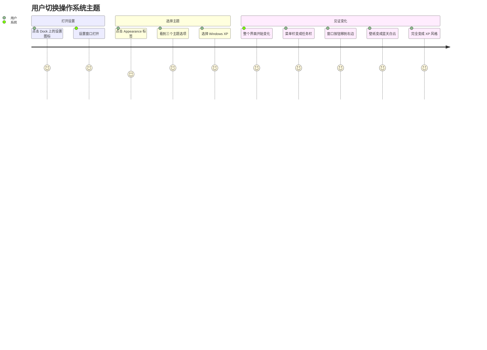
```mermaid
journey
    title 用户切换操作系统主题
    section 打开设置
      点击 Dock 上的设置图标: 5: 用户
      设置窗口打开: 5: 系统
    section 选择主题
      点击 Appearance 标签: 4: 用户
      看到三个主题选项: 5: 用户
      选择 Windows XP: 5: 用户
    section 见证变化
      整个界面开始变化: 5: 系统
      菜单栏变成任务栏: 5: 用户
      窗口按钮移到右边: 5: 用户
      壁纸变成蓝天白云: 5: 用户
      完全变成 XP 风格: 5: 用户
```

---

## 旅程六：登录并同步数据

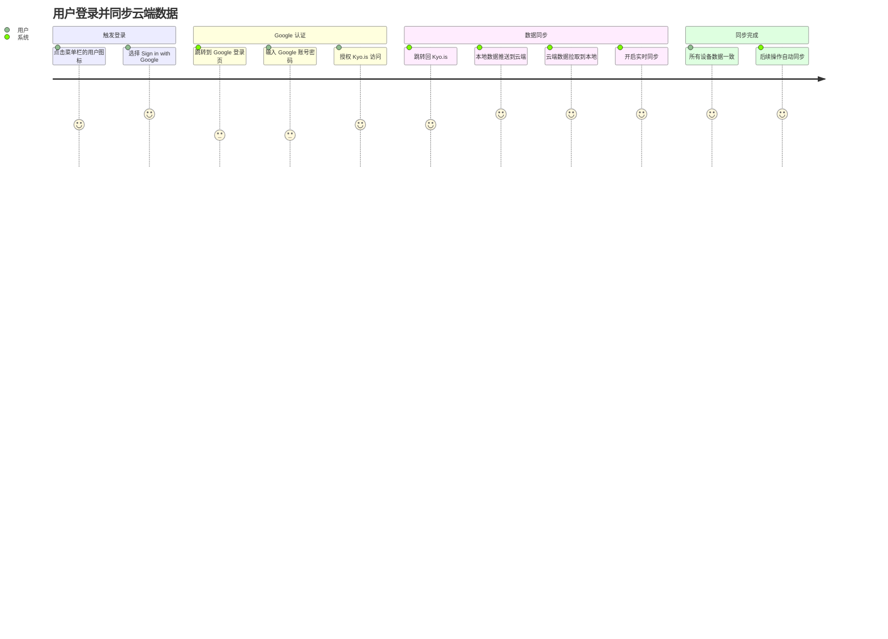
```mermaid
journey
    title 用户登录并同步云端数据
    section 触发登录
      点击菜单栏的用户图标: 4: 用户
      选择 Sign in with Google: 5: 用户
    section Google 认证
      跳转到 Google 登录页: 3: 系统
      输入 Google 账号密码: 3: 用户
      授权 Kyo.is 访问: 4: 用户
    section 数据同步
      跳转回 Kyo.is: 4: 系统
      本地数据推送到云端: 5: 系统
      云端数据拉取到本地: 5: 系统
      开启实时同步: 5: 系统
    section 同步完成
      所有设备数据一致: 5: 用户
      后续操作自动同步: 5: 系统
```

### 登录同步的详细流程

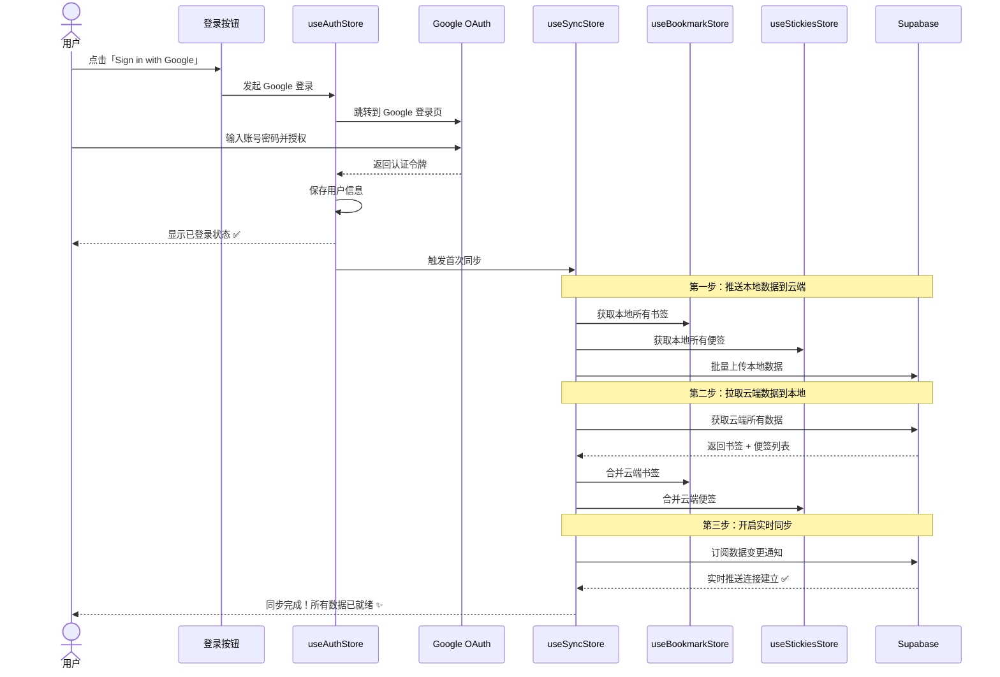
```mermaid
sequenceDiagram
    actor 用户
    participant 登录按钮
    participant 认证 as useAuthStore
    participant Google as Google OAuth
    participant 同步 as useSyncStore
    participant 书签 as useBookmarkStore
    participant 便签 as useStickiesStore
    participant 云端 as Supabase

    用户->>登录按钮: 点击「Sign in with Google」
    登录按钮->>认证: 发起 Google 登录

    认证->>Google: 跳转到 Google 登录页
    用户->>Google: 输入账号密码并授权
    Google-->>认证: 返回认证令牌

    认证->>认证: 保存用户信息
    认证-->>用户: 显示已登录状态 ✅

    认证->>同步: 触发首次同步

    Note over 同步, 云端: 第一步：推送本地数据到云端

    同步->>书签: 获取本地所有书签
    同步->>便签: 获取本地所有便签
    同步->>云端: 批量上传本地数据

    Note over 同步, 云端: 第二步：拉取云端数据到本地

    同步->>云端: 获取云端所有数据
    云端-->>同步: 返回书签 + 便签列表

    同步->>书签: 合并云端书签
    同步->>便签: 合并云端便签

    Note over 同步, 云端: 第三步：开启实时同步

    同步->>云端: 订阅数据变更通知
    云端-->>同步: 实时推送连接建立 ✅

    同步-->>用户: 同步完成！所有数据已就绪 ✨
```

---

## 旅程七：使用白噪音专注

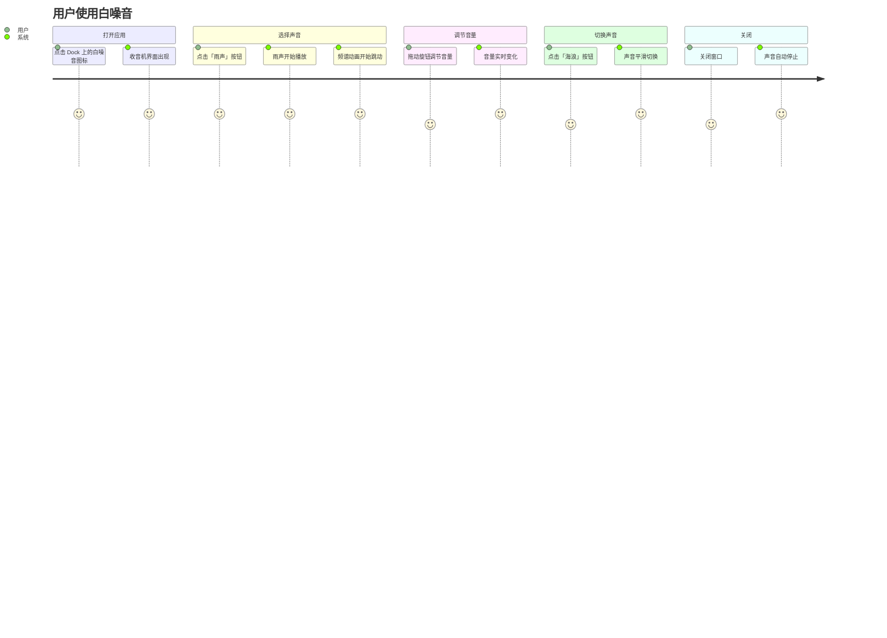
```mermaid
journey
    title 用户使用白噪音
    section 打开应用
      点击 Dock 上的白噪音图标: 5: 用户
      收音机界面出现: 5: 系统
    section 选择声音
      点击「雨声」按钮: 5: 用户
      雨声开始播放: 5: 系统
      频谱动画开始跳动: 5: 系统
    section 调节音量
      拖动旋钮调节音量: 4: 用户
      音量实时变化: 5: 系统
    section 切换声音
      点击「海浪」按钮: 4: 用户
      声音平滑切换: 5: 系统
    section 关闭
      关闭窗口: 4: 用户
      声音自动停止: 5: 系统
```

### 白噪音播放流程

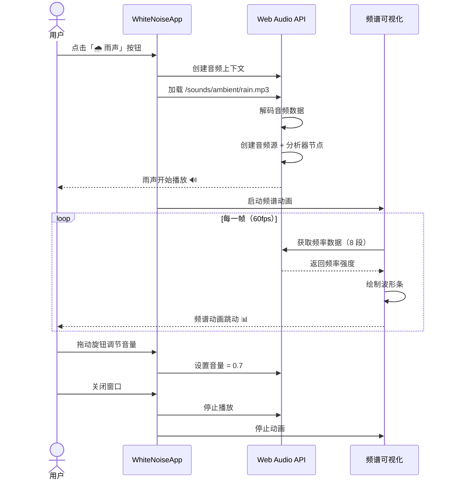
```mermaid
sequenceDiagram
    actor 用户
    participant 收音机 as WhiteNoiseApp
    participant 音频 as Web Audio API
    participant 频谱 as 频谱可视化

    用户->>收音机: 点击「🌧️ 雨声」按钮

    收音机->>音频: 创建音频上下文
    收音机->>音频: 加载 /sounds/ambient/rain.mp3
    音频->>音频: 解码音频数据
    音频->>音频: 创建音频源 + 分析器节点
    音频-->>用户: 雨声开始播放 🔊

    收音机->>频谱: 启动频谱动画

    loop 每一帧（60fps）
        频谱->>音频: 获取频率数据（8 段）
        音频-->>频谱: 返回频率强度
        频谱->>频谱: 绘制波形条
        频谱-->>用户: 频谱动画跳动 📊
    end

    用户->>收音机: 拖动旋钮调节音量
    收音机->>音频: 设置音量 = 0.7

    用户->>收音机: 关闭窗口
    收音机->>音频: 停止播放
    收音机->>频谱: 停止动画
```

---

## 旅程八：移动端体验

```mermaid
journey
    title 手机用户的体验
    section 进入网站
      手机打开 kyo.is: 5: 用户
      看到移动端桌面: 5: 系统
    section 浏览桌面
      左右滑动翻页: 5: 用户
      看到应用图标网格: 5: 系统
      看到底部圆点指示器: 4: 用户
    section 打开应用
      点击应用图标: 5: 用户
      应用全屏打开: 5: 系统
      上下滑动浏览内容: 4: 用户
    section 特殊交互
      长按图标: 4: 用户
      弹出操作菜单: 5: 系统
```

### 移动端 vs 桌面端的交互差异

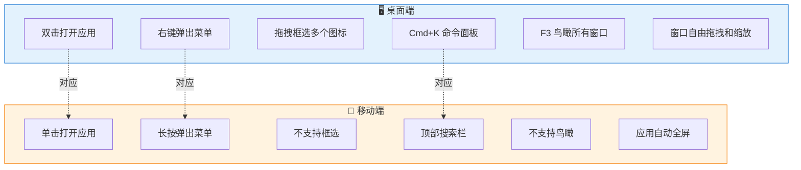
```mermaid
graph TB
    subgraph 桌面端交互["🖥️ 桌面端"]
        D1["双击打开应用"]
        D2["右键弹出菜单"]
        D3["拖拽框选多个图标"]
        D4["Cmd+K 命令面板"]
        D5["F3 鸟瞰所有窗口"]
        D6["窗口自由拖拽和缩放"]
    end

    subgraph 移动端交互["📱 移动端"]
        M1["单击打开应用"]
        M2["长按弹出菜单"]
        M3["不支持框选"]
        M4["顶部搜索栏"]
        M5["不支持鸟瞰"]
        M6["应用自动全屏"]
    end

    D1 -.->|对应| M1
    D2 -.->|对应| M2
    D4 -.->|对应| M4

    style 桌面端交互 fill:#E3F2FD,stroke:#1976D2
    style 移动端交互 fill:#FFF3E0,stroke:#F57C00
```

---

## 旅程九：使用 Chrome 扩展

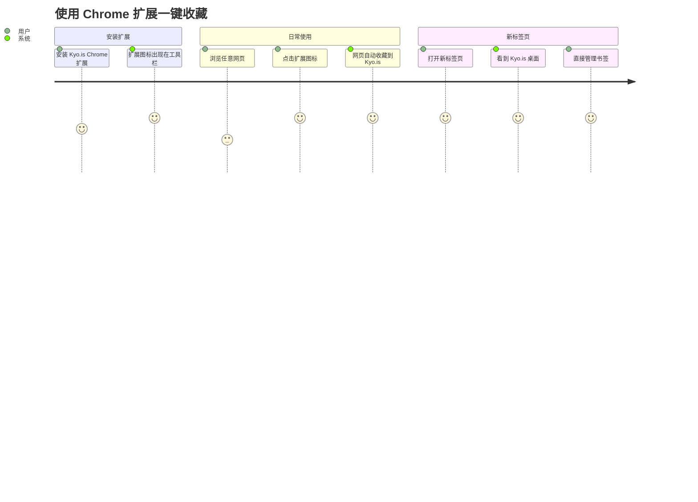
```mermaid
journey
    title 使用 Chrome 扩展一键收藏
    section 安装扩展
      安装 Kyo.is Chrome 扩展: 4: 用户
      扩展图标出现在工具栏: 5: 系统
    section 日常使用
      浏览任意网页: 3: 用户
      点击扩展图标: 5: 用户
      网页自动收藏到 Kyo.is: 5: 系统
    section 新标签页
      打开新标签页: 5: 用户
      看到 Kyo.is 桌面: 5: 系统
      直接管理书签: 5: 用户
```

### Chrome 扩展的工作原理

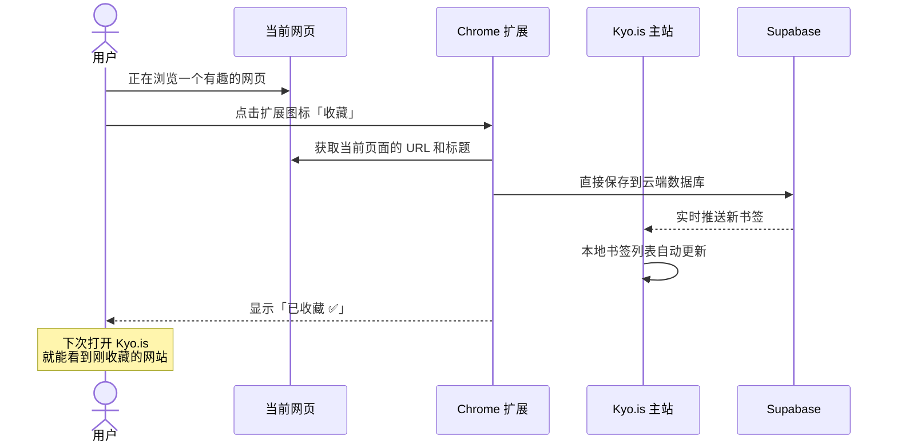
```mermaid
sequenceDiagram
    actor 用户
    participant 网页 as 当前网页
    participant 扩展 as Chrome 扩展
    participant KyoIs as Kyo.is 主站
    participant 云端 as Supabase

    用户->>网页: 正在浏览一个有趣的网页
    用户->>扩展: 点击扩展图标「收藏」

    扩展->>网页: 获取当前页面的 URL 和标题
    扩展->>云端: 直接保存到云端数据库

    云端-->>KyoIs: 实时推送新书签
    KyoIs->>KyoIs: 本地书签列表自动更新

    扩展-->>用户: 显示「已收藏 ✅」

    Note over 用户: 下次打开 Kyo.is<br/>就能看到刚收藏的网站
```

---

## 旅程十：备份和恢复

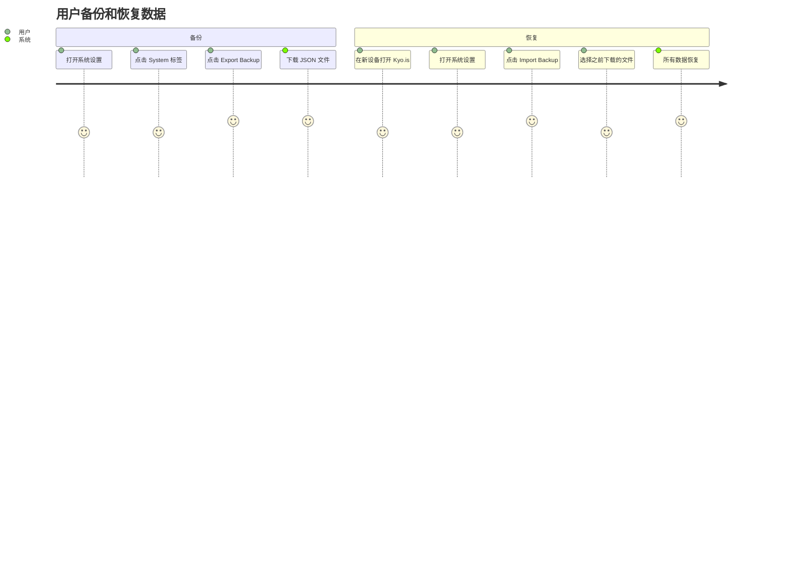
```mermaid
journey
    title 用户备份和恢复数据
    section 备份
      打开系统设置: 4: 用户
      点击 System 标签: 4: 用户
      点击 Export Backup: 5: 用户
      下载 JSON 文件: 5: 系统
    section 恢复
      在新设备打开 Kyo.is: 4: 用户
      打开系统设置: 4: 用户
      点击 Import Backup: 5: 用户
      选择之前下载的文件: 4: 用户
      所有数据恢复: 5: 系统
```

### 备份包含哪些数据？

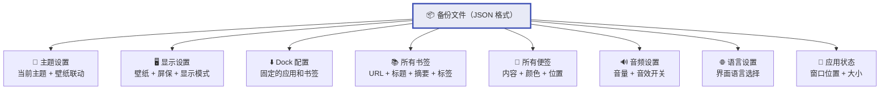
```mermaid
graph TB
    Backup["📦 备份文件（JSON 格式）"]

    Backup --> Theme["🎨 主题设置<br/>当前主题 + 壁纸联动"]
    Backup --> Display["🖥️ 显示设置<br/>壁纸 + 屏保 + 显示模式"]
    Backup --> Dock["⬇️ Dock 配置<br/>固定的应用和书签"]
    Backup --> Bookmarks["📚 所有书签<br/>URL + 标题 + 摘要 + 标签"]
    Backup --> Stickies["📝 所有便签<br/>内容 + 颜色 + 位置"]
    Backup --> Audio["🔊 音频设置<br/>音量 + 音效开关"]
    Backup --> Language["🌐 语言设置<br/>界面语言选择"]
    Backup --> AppState["📱 应用状态<br/>窗口位置 + 大小"]

    style Backup fill:#E8EAF6,stroke:#3F51B5,stroke-width:3px
```

---

## 所有旅程的入口汇总

```mermaid
graph TB
    User["👤 用户"]

    User --> Desktop["🖥️ 桌面<br/>双击图标打开应用<br/>粘贴链接收藏网站<br/>框选批量操作"]

    User --> Dock["⬇️ Dock 栏<br/>点击图标启动应用<br/>点击书签打开网站<br/>查看最小化窗口"]

    User --> MenuBar["📋 菜单栏<br/>Apple 菜单<br/>应用菜单<br/>时钟和音量"]

    User --> CmdK["⌨️ Cmd+K<br/>搜索应用<br/>搜索书签<br/>快速提问 AI"]

    User --> Extension["🧩 Chrome 扩展<br/>一键收藏当前网页<br/>新标签页即桌面"]

    User --> URL["🔗 URL 直达<br/>kyo.is/bookmarks<br/>直接打开对应应用"]

    style User fill:#E8EAF6,stroke:#3F51B5,stroke-width:3px
```

---

> **上一篇**: [04-theme-system.md](./04-theme-system.md) — 主题系统
> **下一篇**: [06-cloud-sync.md](./06-cloud-sync.md) — 云端同步详解
