# 云端同步：数据如何跨设备保持一致

> 写给不懂技术的你：你的书签和便签是怎么在手机、电脑、平板之间同步的？

---

## 一句话理解

Kyo.is 采用「离线优先」策略——没有网络也能正常使用，联网后自动同步到云端，确保所有设备数据一致。

---

## 同步系统全景图

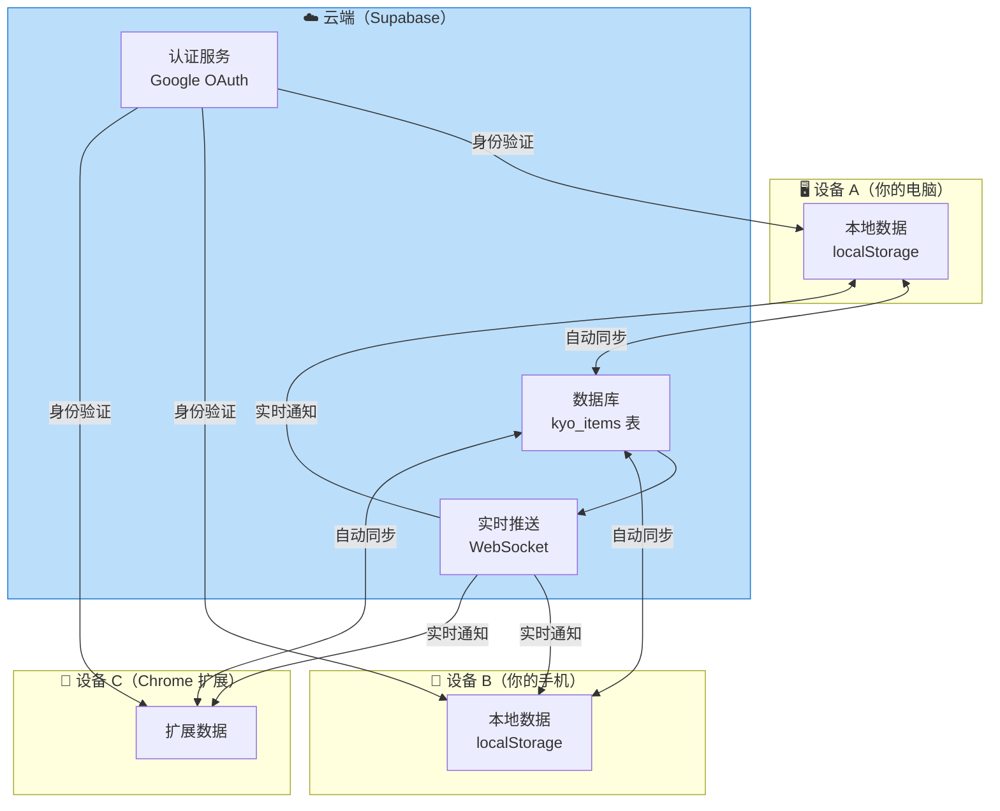

---

## 登录认证流程

### 为什么需要登录？

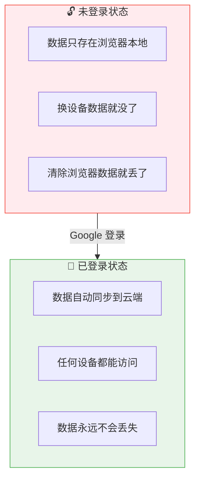

### Google 登录的详细流程

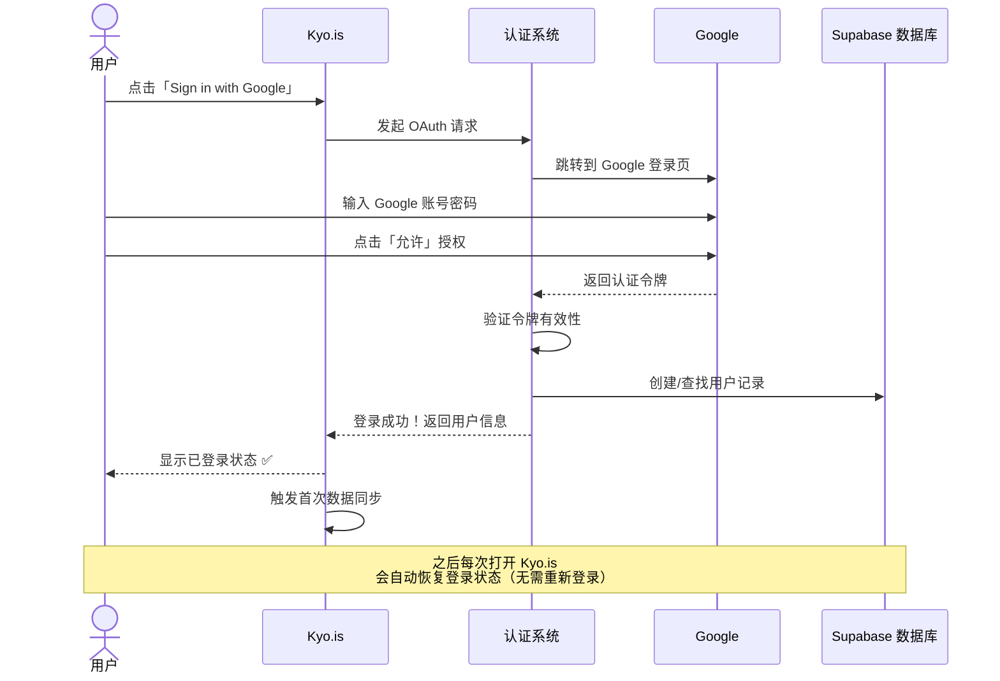

---

## 首次同步：本地数据和云端数据的合并

首次登录时，系统需要处理一个关键问题：用户可能在登录前已经创建了一些书签和便签。

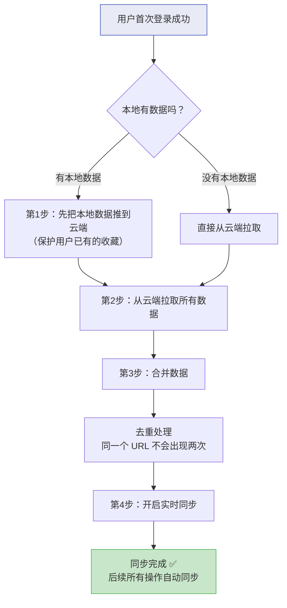

### 首次同步的时序图

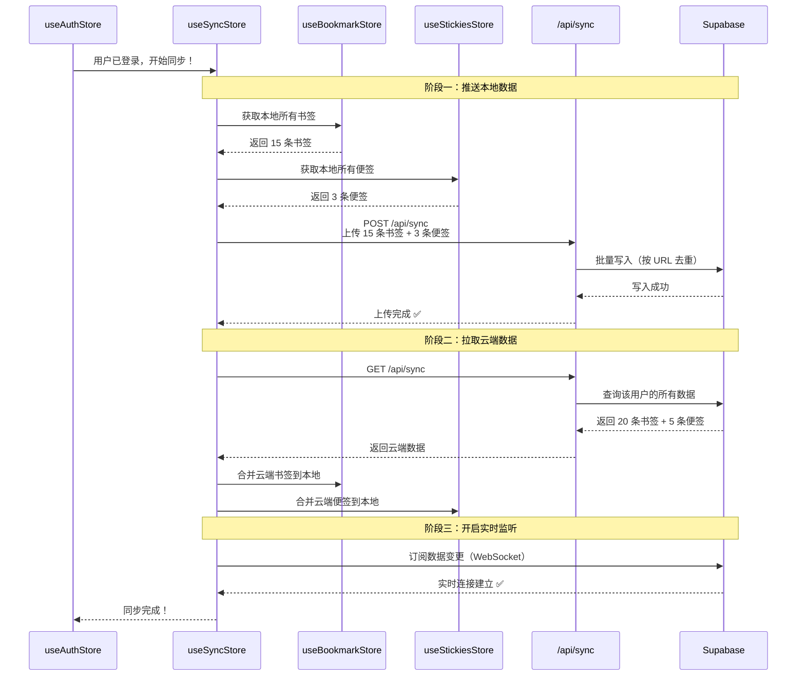

---

## 日常同步：实时双向同步

登录后，每次操作都会自动同步：

### 本地操作 → 云端

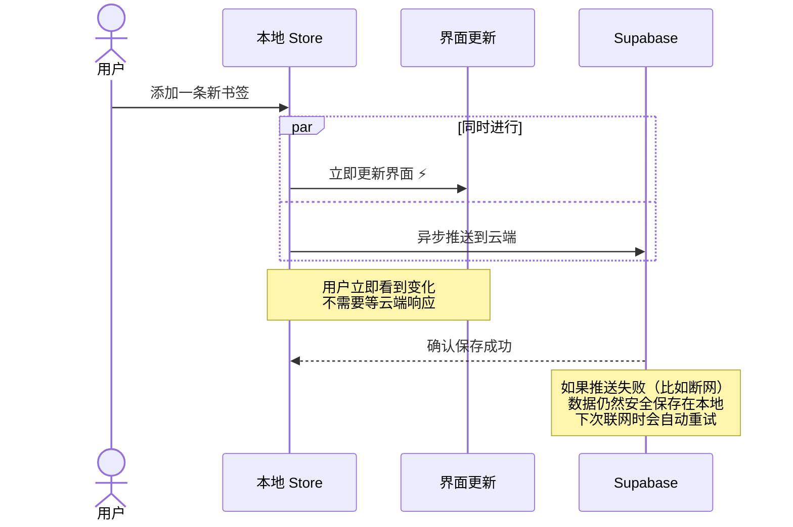

### 云端变更 → 本地

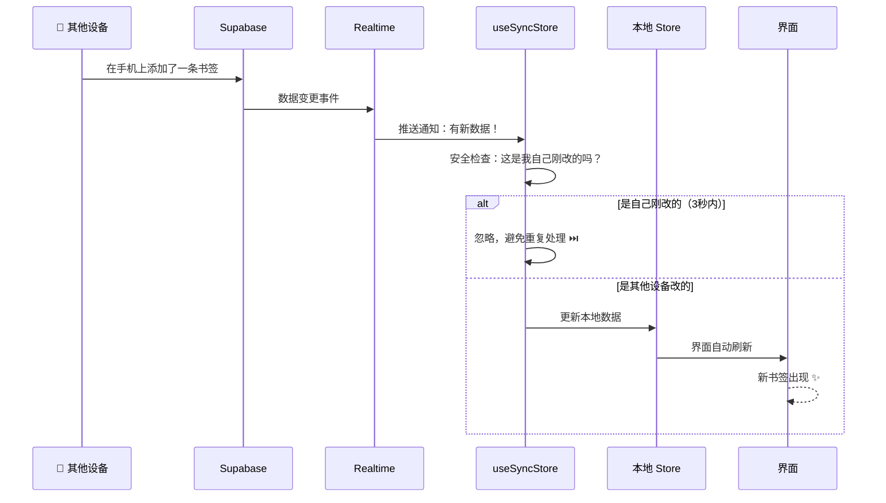

---

## 冲突处理：当两台设备同时修改

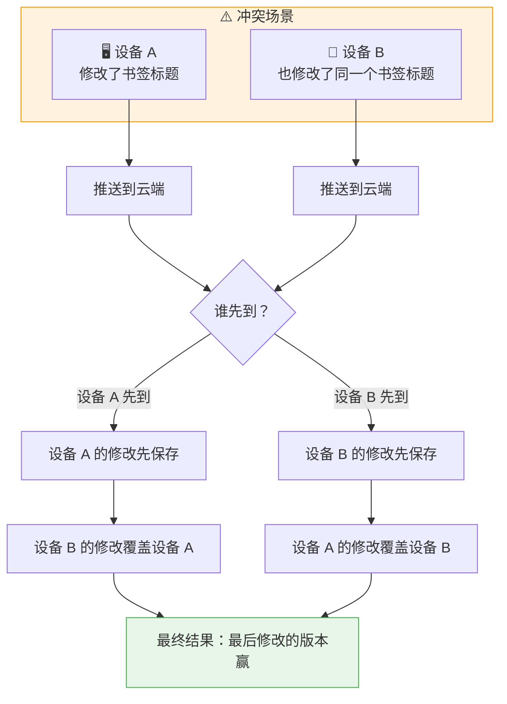

### 防回写机制

为了避免「自己的修改被自己的推送覆盖」这种尴尬情况：

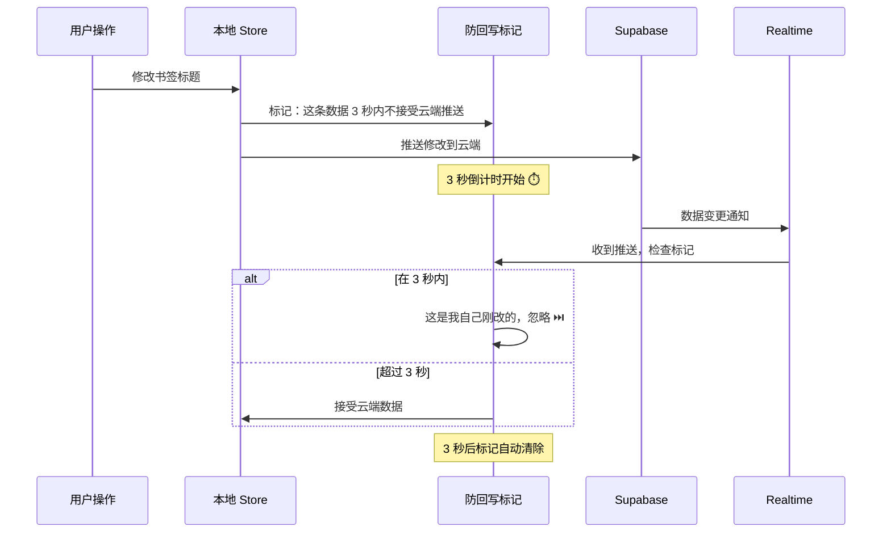

---

## 离线模式：没有网络怎么办？

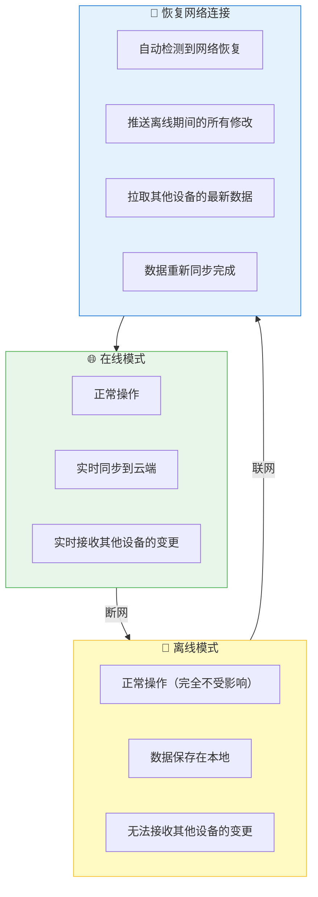

---

## 数据安全：你的数据有多安全？

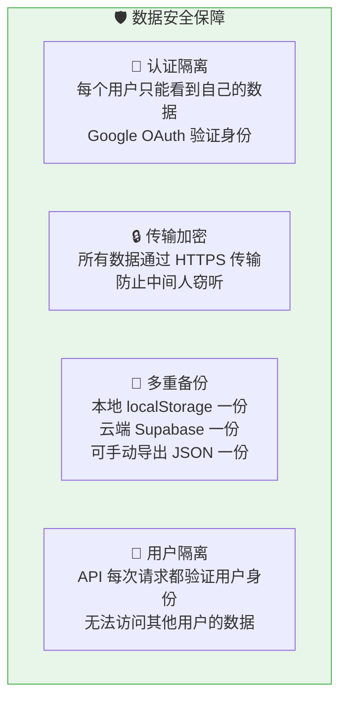

---

## 同步的数据范围

不是所有数据都会同步到云端：

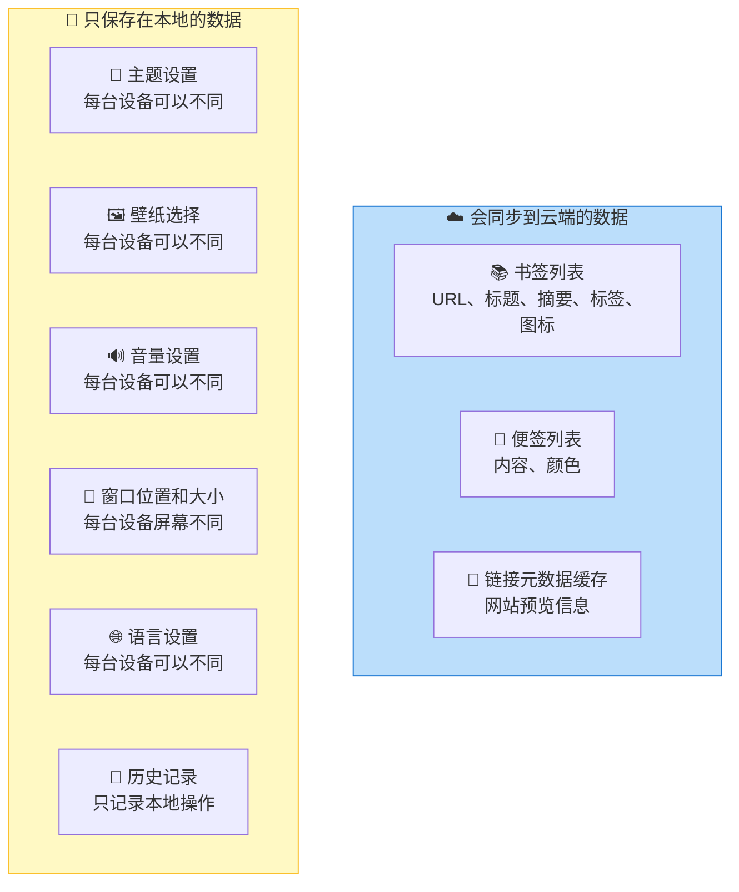

---

## Chrome 扩展的同步

Chrome 扩展和主站之间也有同步机制：

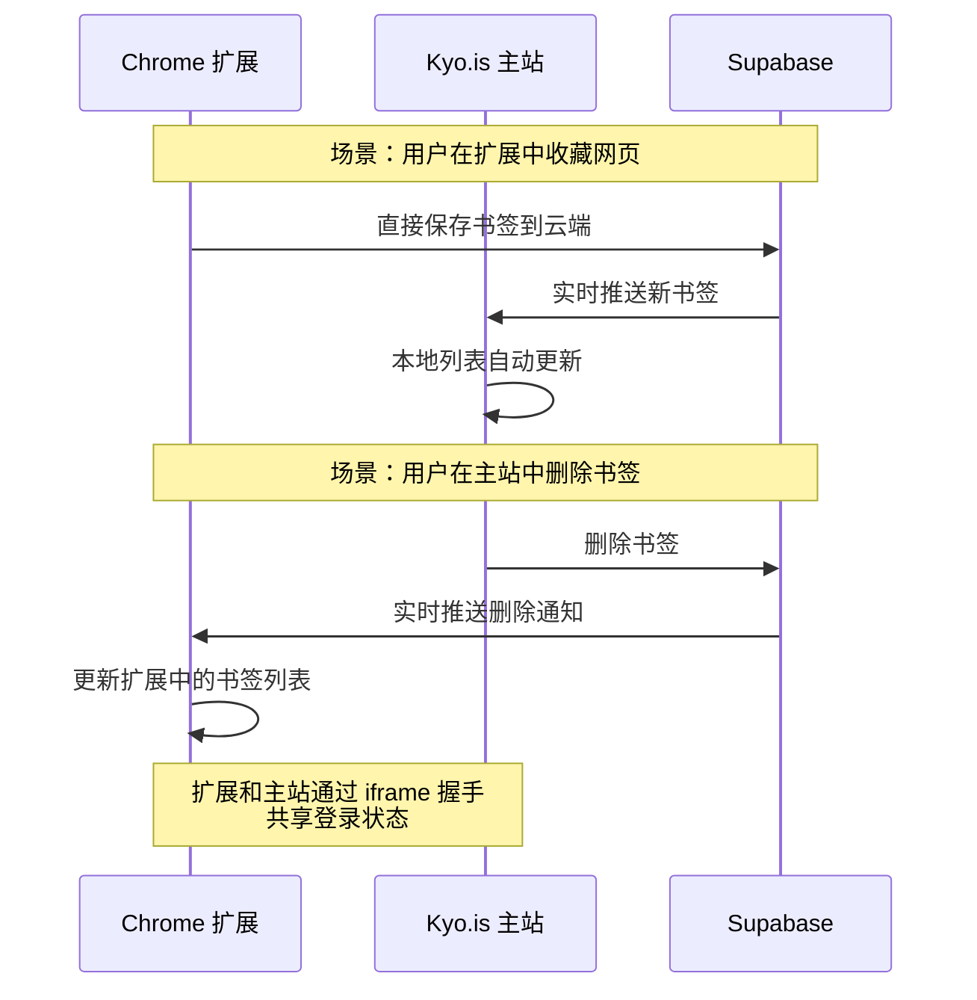

### 扩展登录状态同步

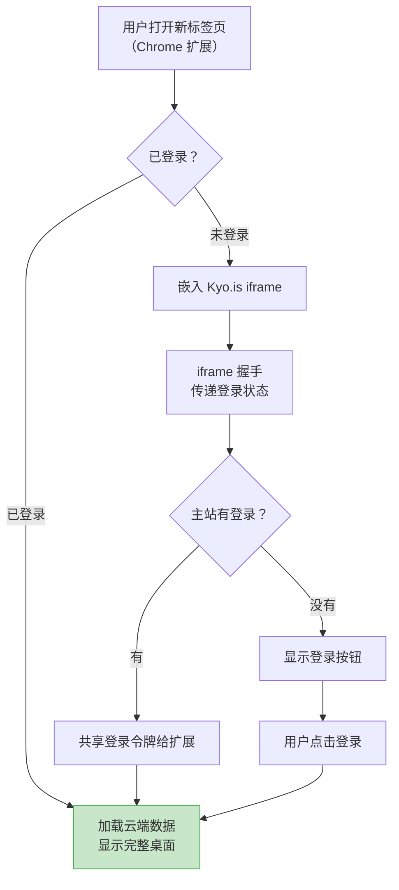

---

## 同步状态指示

用户如何知道数据是否已同步？

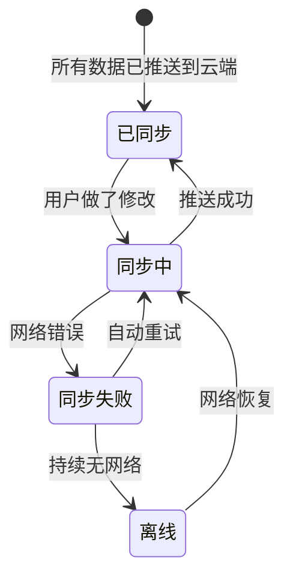

---

## 数据生命周期总览

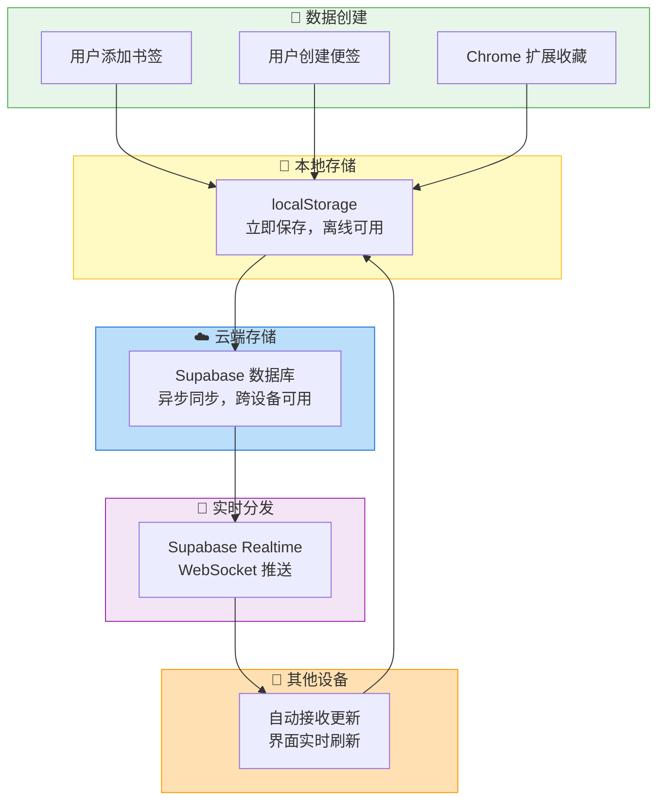

---

## 常见问题

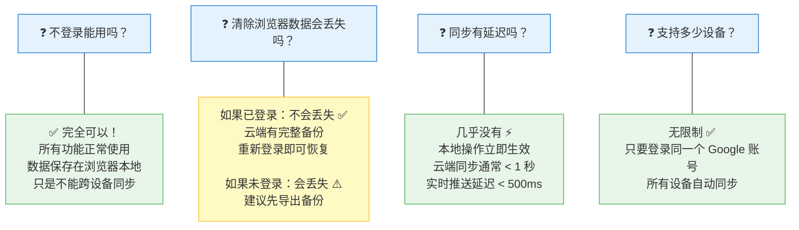

---

> **上一篇**: [05-user-journey.md](./05-user-journey.md) — 用户旅程地图
> **系列完结** — 感谢阅读！如有疑问，欢迎随时提问。
